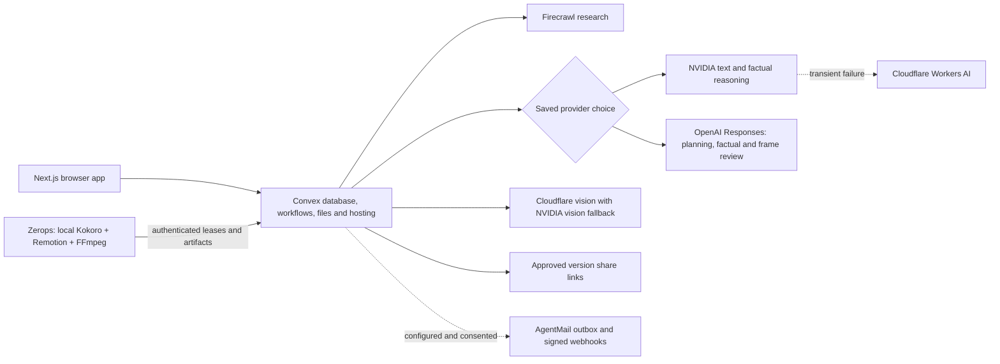

# Release operations

## Topology



Convex owns job state, checkpoints, retries, quotas, ownership, icon vectors, reviews, immutable versions, shares and outbox records. A stopped media worker can be replaced using lease fencing. Each lesson chooses NVIDIA/Cloudflare (default) or OpenAI, with no cross-route fallback. Kokoro-82M runs locally on the worker for both routes. No GitHub Actions are used.

## Deploy and verify

1. `npm ci` followed by `npm run check`. Tests use isolated providers; they do not send mail or prove live model accuracy.
2. `npx convex dev --once` for the development backend; `npx convex deploy --yes` for production.
3. `npx @convex-dev/static-hosting deploy --dist out --build-command "npm run build:web" --skip-convex`. This builds against the production Convex URL rather than uploading a dev bundle.
4. Push the Zerops `mediaworker` setup in `zerops.yaml`. Check service ACTIVE and a fresh `workers` heartbeat. Version 0.5.6 supports protocol 5, named causal edges and text cards. A protocol-4 worker cannot claim a text-card job.
5. Open `/api/health` on the public site. Check actual generation readiness, not just HTTP 200. NIM readiness requires qualified providers and the complete embedding catalog. OpenAI readiness uses its own server key and model plus shared Firecrawl; the model is checked before starting work.
6. Generate one real production question; inspect the final video, captions, source links, review, revision, public share and revoke behavior. Only publish manually inspected approved examples through `showcase:publish`.
7. Push GitHub and verify Vercel's `explainer-studio-checks` build for that exact commit. Local success does not imply a passing remote build.

## Recovery and limits

- Text generation has at most three validation attempts per provider. Transient NVIDIA failures switch to Cloudflare. Auth errors fail immediately. A Cloudflare daily-allocation exhaustion requires the quota reset or the owner's chosen plan change; no paid upgrade is performed automatically.
- Owners can retry a failed pre-render plan once; saved research is reused. Owners can retry an unavailable review once using the saved video. These actions cannot reopen a rejected version as approved.
- Review workflow has three attempts with 30/60-second backoff. The factual pass uses reasoning-enabled NVIDIA with Cloudflare fallback; frame review sends real JPEG bytes to qualified vision models. Both must pass.
- One automatic repair and two requested scene edits per lesson. The compiler preserves unaffected scenes, chooses complete narration sentences, canonical icons or literal text cards, ordered spoken cues and explicit causal edges. It never turns an absent endpoint into a different causal edge.
- Operator recovery functions are internal, version-scoped and intended for implementation fixes. Record their use in evaluation results; do not call recovered runs first-pass successes.
- Share links expire after seven days and can be revoked. Revocation prevents future page resolution; it cannot erase an already downloaded video or a previously copied underlying file URL.
- Public showcase entries are deliberately published by an operator. Ordinary user lessons do not appear automatically. Keep public examples separate from user workspaces.

## Pause and rollback

Set `GENERATION_ENABLED=false` on production to pause new general generation; the scripted renderer demo remains separately labelled. Cancel active jobs through the app if needed. Restore a known code commit, run checks, redeploy Convex/static hosting, and deploy the matching worker. Do not revert database schema or discard immutable versions as an incidental rollback. Worker protocol fencing must remain compatible with queued jobs.

## Optional OpenAI setup

Set `OPENAI_API_KEY` and optionally `OPENAI_MODEL` in ignored `.env`. The default is `gpt-5.4-mini`, which supports Responses, structured outputs and image input. Run `npm run openai:setup -- --prod` for production or omit `-- --prod` for development. Setup checks model access and copies only these two settings to Convex; it does not activate generation or claim an actual video/inference acceptance. Never place the key in a public environment variable.

The user selects a route before generation; the stored route persists through retries and scene edits. Missing key, auth failure, unavailable model and rate/usage limits produce safe toasts. The explicit OpenAI route handles authoring, factual review, frame review and repairs; Firecrawl, canonical icons, Kokoro and Remotion are shared. OpenAI uses the bundled literal asset catalog without calling Cloudflare embeddings. NIM keeps its existing qualified vector index. Both routes preserve approval gates and quotas.

Model preflight is authenticated and limited per workspace and globally. Existing-lesson preflight remains available while new generation is paused. Upstream errors never copy raw provider response bodies into public toasts.

## Email setup

Put `AGENTMAIL_API_KEY`, `AGENTMAIL_INBOX_ID` and `AGENTMAIL_WEBHOOK_SECRET` in ignored `.env`, then run `npm run delivery:setup` and separately `npm run delivery:setup -- --prod` for the intended deployment. Configure AgentMail's webhook to `https://<deployment>.convex.site/api/webhooks/agentmail` with the subscribed delivery events described in `docs/review-delivery.md`. Use the matching webhook secret.

Setup does not send messages. A person must consent to verification, enter the received code, and separately consent to sending an approved lesson. Record the actual sent/delivered/bounced result. A configured variable or mocked webhook is not proof of email delivery.

The AgentMail API key needs `inbox_read` for setup qualification and `message_send` for delivery, with access to the configured inbox. If setup returns 403 with `missing_permission`, correct the key's permissions in the AgentMail console and replace `AGENTMAIL_API_KEY` in `.env`. The webhook signing secret does not authorize inbox API requests.

## Known product boundaries

This release targets short English science and everyday-mechanism explainers, one visual style, two- and three-node diagrams, 24 pinned OpenMoji assets and animated word cards for concepts without faithful icons. It is not an unrestricted animation editor. Kokoro token timing is predicted, not forced alignment. Two sampled frames per scene do not establish that every frame is perfect. The automated factual editor can still miss errors; manual inspection remains necessary before a public demo.


## Repeat a topic evaluation

The tracked evaluator uses normal public app operations, without admin recovery or requested edits. It does not send mail. Select one to five topics before tuning, run against the intended deployment, and preserve every outcome.

```sh
node scripts/evaluate-topics.mjs --deployment https://YOUR.convex.cloud --out runs/evaluation --topics docs/evaluation-topics.json
# Resume the saved workspace after interruption (jobs continue in Convex):
node scripts/evaluate-topics.mjs --deployment https://YOUR.convex.cloud --out runs/evaluation --resume
```

`workspace.json` contains a private creator token and stays under ignored runs/. Share only the sanitized report.json after reviewing it. A stopped CLI does not cancel backend jobs. Use the app's cancel action if cancellation is intended. `--indices 0,2,4` selects a predeclared subset for separate identical deployments; report the combined denominator and both runtime platforms. Do not count automatic approvals as manual quality passes or change topics after observing failures.

Production AgentMail inbox access and a scoped `message.sent`/`message.delivered`/`message.bounced` webhook were configured during 0.6.0 preparation. The returned signing secret is in ignored `.env` and production Convex. Development requires its own webhook and secret. A consented verification and actual received lesson remain separate acceptance steps.
