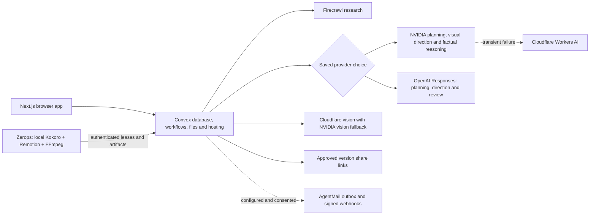

# Release operations

**Current visual rollout:** the illustrated clean-canvas renderer is implemented, but visual acceptance remains open. The actual NIM-authored 60-second lesson rendered; revision 1 was rejected and revision 2's review was unavailable. OpenAI remains intentionally disabled. Consult the [visual acceptance record](visual-acceptance-070.md) for exact versions, checks, deployment state and attempt history before operating the release. The 0.6.0 results remain historical evidence.

## Topology



Convex owns job state, checkpoints, retries, quotas, ownership, icon vectors, reviews, immutable versions, shares and outbox records. A stopped media worker can be replaced using lease fencing. Each lesson chooses NVIDIA/Cloudflare (default) or OpenAI, with no cross-route fallback. Kokoro-82M runs locally on the worker for both routes. No GitHub Actions are used.

## Deploy and verify

1. `npm ci` followed by `npm run check`. Tests use isolated providers; they do not send mail or prove live model accuracy.
2. `npx convex dev --once` for the development backend; `npx convex deploy --yes` for production.
3. `npx @convex-dev/static-hosting deploy --dist out --build-command "npm run build:web" --skip-convex`. This builds against the production Convex URL rather than uploading a dev bundle.
4. Push the Zerops `mediaworker` setup in `zerops.yaml`. Check service ACTIVE and a fresh `workers` heartbeat matching the deployed version. Native directed scenes require protocol 6; imported-asset scenes require protocol 7 and `library-assets-v1`, introduced in 0.8.0. Deploy the backend's protocol/heartbeat handling before the nine-capability worker; asset jobs wait for that compatible worker. `npm run assets:verify` validates its bundled files during the Zerops build. The worker retains legacy scene support. See [asset library](asset-library.md) for the current catalog and rollout evidence.
5. Open `/api/health` on the public site. Check actual generation readiness, not just HTTP 200. NIM readiness requires qualified providers and the complete embedding catalog. OpenAI readiness uses its own server key and model plus shared Firecrawl; the model is checked before starting work.
6. Generate one real production question; inspect the final video, captions, source links, review, revision, public share and revoke behavior. Only publish manually inspected approved examples through `showcase:publish`.
7. Push GitHub and verify Vercel's `explainer-studio-checks` build for that exact commit. Local success does not imply a passing remote build.

## Recovery and limits

- New and resumed research/planning, visual-direction, model-review and scene-edit workflows allow **five total attempts per failed step**: the initial attempt and up to four retries for transient HTTP 429, timeout, network and HTTP 5xx failures. The four backoffs are **30, 60, 120 and 240 seconds**, plus up to 20% jitter. A valid `Retry-After` can extend the wait. A provider cooldown longer than five minutes pauses automatic work for manual Resume after that deadline; the deadline also survives exhaustion of the fifth attempt. This policy is scoped to these workflows, not every application API or the media worker's lease retries.
- Exhausted credits/quota, authentication and unavailable-model errors stop automatic retries. Correct the provider configuration or wait for its quota reset before resuming; no paid upgrade occurs automatically. Invalid model output retains its separate bounded validation/correction attempts and does not become a transient failure just because a fallback is rate limited. NVIDIA/Cloudflare fallback remains within that selected route; OpenAI is separate and remains intentionally disabled by the owner.
- The lesson's recovery panel shows a safe failure reason, stage, saved checkpoint, attempt count and next wait. Automatic retries run in Convex even after the browser closes. **Resume from saved progress** is available only for an eligible failed lesson, with up to **five owner resumes per hour per workspace** and at least **60 seconds between resumes of the same lesson**, also respecting the provider cooldown. Request IDs make repeated or uncertain submissions idempotent. The server checks ownership, required setup, cooldown and capacity; this action does not run a browser model preflight or create a new lesson.
- Resume reuses saved research, script, illustration selection, directed scenes and the complete render project; completed factual/scene reviews and scene-edit checkpoints are also retained. A failed render restarts from its saved project and can reuse cached narration, rather than continuing a partially encoded MP4. Cancelled/completed lessons and failures without a usable checkpoint cannot be resumed. Recovery does not approve a rejected draft or bypass scene-edit, sharing or email gates.
- New lessons receive a separate visual plan for each scene. Checkpoints retain provider attempts; resumed planning revalidates saved visual plans before reuse. A failed director does not silently emit the old word-card layout. Record each operator resume separately from normal user retries and initial-run outcomes.
- On the NVIDIA/Cloudflare route, the factual pass uses reasoning-enabled NVIDIA with Cloudflare fallback; frame review sends real JPEG bytes to qualified vision models. Both checks must pass. Resuming the same scene edit retains its request and edit budget.
- Rich scenes provide three action-aware JPEG samples per scene, derived from validated Kokoro word timing; legacy scenes provide two. Verify complete scene coverage and the actual ordered action frames. The review budget is 2 MB per JPEG and 8 MB total decoded JPEG bytes. Sparse samples still require manual normal-speed playback and inspection of important motion.
- One automatic repair and two requested scene edits per lesson. The compiler preserves unaffected scenes and their visual plans, uses complete narration sentences, and redirects changed rich scenes through the selected provider. Legacy scenes retain canonical icons/text cards and explicit causal edges. A repair cannot drop a rich scene's visual plan or silently change untouched content.
- Operator recovery functions are internal, version-scoped and intended for implementation fixes. Record their use in evaluation results; do not call recovered runs first-pass successes.
- Share links expire after seven days and can be revoked. Revocation prevents future page resolution; it cannot erase an already downloaded video or a previously copied underlying file URL.
- Public showcase entries are deliberately published by an operator. Ordinary user lessons do not appear automatically. Keep public examples separate from user workspaces.

## Pause and rollback

Set `GENERATION_ENABLED=false` on production to pause new general generation; the scripted renderer demo remains separately labelled. Cancel active jobs through the app if needed. Restore a known code commit, run checks, redeploy Convex/static hosting, and deploy the matching worker. Do not revert database schema or discard immutable versions as an incidental rollback. Worker protocol fencing must remain compatible with queued jobs.

## Optional OpenAI setup

Set `OPENAI_API_KEY` and optionally `OPENAI_MODEL` in ignored `.env`. The default is `gpt-5.4-mini`, which supports Responses, structured outputs and image input. Run `npm run openai:setup -- --prod` for production or omit `-- --prod` for development. Setup checks model access and copies only these two settings to Convex; it does not activate generation or claim an actual video/inference acceptance. Never place the key in a public environment variable.

The user selects a route before generation; the stored route persists through retries and scene edits. Missing key, auth failure, unavailable model and rate/usage limits produce safe toasts. The explicit OpenAI route handles authoring, visual direction, factual review, frame review and repairs; Firecrawl, local illustration vocabulary, Kokoro and Remotion are shared. OpenAI uses the bundled literal asset catalog without calling Cloudflare embeddings. NIM keeps its existing qualified vector index. Both routes preserve approval gates and quotas. OpenAI is currently intentionally disabled at the owner's request.

Model preflight is authenticated and limited per workspace and globally. Existing-lesson preflight remains available while new generation is paused. Upstream errors never copy raw provider response bodies into public toasts.

## Email setup

Put `AGENTMAIL_API_KEY`, `AGENTMAIL_INBOX_ID` and `AGENTMAIL_WEBHOOK_SECRET` in ignored `.env`, then run `npm run delivery:setup` and separately `npm run delivery:setup -- --prod` for the intended deployment. Configure AgentMail's webhook to `https://<deployment>.convex.site/api/webhooks/agentmail` with the subscribed delivery events described in `docs/review-delivery.md`. Use the matching webhook secret.

Setup does not send messages. A person must consent to verification, enter the received code, and separately consent to sending an approved lesson. Record the actual sent/delivered/bounced result. A configured variable or mocked webhook is not proof of email delivery.

The AgentMail API key needs `inbox_read` for setup qualification and `message_send` for delivery, with access to the configured inbox. If setup returns 403 with `missing_permission`, correct the key's permissions in the AgentMail console and replace `AGENTMAIL_API_KEY` in `.env`. The webhook signing secret does not authorize inbox API requests.

## Known product boundaries

The directed renderer targets short English explainers with 2–12 illustrated entities per scene, a bounded relationship/action vocabulary and 51 visual kinds, including 35 original everyday illustrations. New lessons use native SVG on a clean canvas without fixed headers, footers or burned captions. The legacy renderer remains for saved projects; existing MP4s are unchanged. Model-authored SVG/code and remote artwork are not accepted. Counts, charges, material bounds, motion direction and visible state changes must match the explanation. Kokoro timing is predicted, not forced alignment. Three sampled frames do not prove every instant is correct, and a hand-authored calibration is not a generated lesson. Manual comparison with the target references remains required before claiming visual quality.


## Repeat a topic evaluation

The tracked evaluator uses normal public app operations, without admin recovery or requested edits. It does not send mail. Select one to five topics before tuning, run against the intended deployment, and preserve every outcome.

```sh
node scripts/evaluate-topics.mjs --deployment https://YOUR.convex.cloud --out runs/evaluation --topics docs/evaluation-topics.json
# Resume the saved workspace after interruption (jobs continue in Convex):
node scripts/evaluate-topics.mjs --deployment https://YOUR.convex.cloud --out runs/evaluation --resume
```

`workspace.json` contains a private creator token and stays under ignored runs/. Share only the sanitized report.json after reviewing it. A stopped CLI does not cancel backend jobs. Use the app's cancel action if cancellation is intended. `--indices 0,2,4` selects a predeclared subset for separate identical deployments; report the combined denominator and both runtime platforms. Do not count automatic approvals as manual quality passes or change topics after observing failures.

Production AgentMail inbox access and a scoped `message.sent`/`message.delivered`/`message.bounced` webhook were configured during 0.6.0 preparation. The returned signing secret is in ignored `.env` and production Convex. Development requires its own webhook and secret. A consented verification and actual received lesson remain separate acceptance steps.
