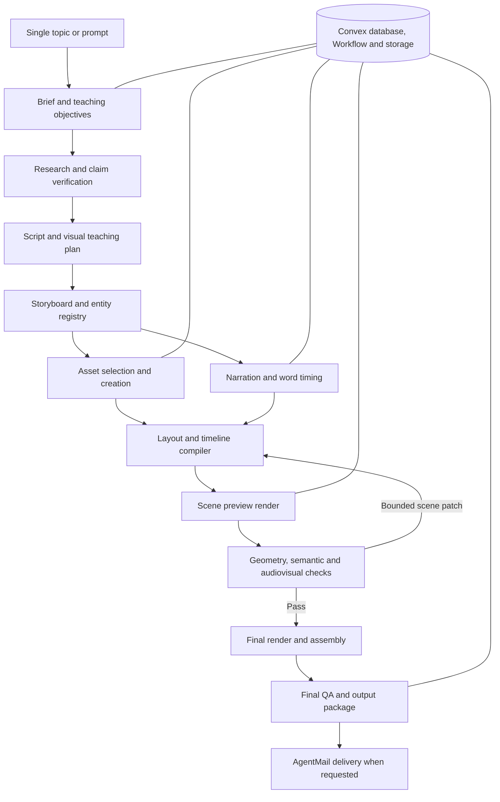

> Current 0.7.0 status: the visual director, 51 bounded illustration kinds, progressive SVG construction, spoken action timing and a clean canvas without fixed overlays are implemented. There are 163 passing tests across 17 files; the full check, including both builds, has passed. Development is staged and the production worker is 0.7.0; the new production backend is not deployed. The canary's fifth workflow attempt (fourth operator resume) is planning, with no generated MP4 yet. [Visual direction and acceptance](docs/visual-direction-070.md) governs this user-requested change and supersedes the earlier repeated card layouts below. Reference matching and user acceptance are not complete.

> Historical 0.6.0 evidence: runtime `04c4635` passed exact-commit Vercel clean-install validation with 117 tests and full builds. Salt's first attempt and separate operator recovery both remained unapproved; the frozen baseline evaluation was 4/5 automatic approvals with manual limitations. Those results do not establish 0.7.0 visual quality. The provider choice remains NVIDIA NIM + Cloudflare by default, with the implemented OpenAI Responses option intentionally disabled at the owner's request. No live OpenAI inference is claimed. See [release evidence](docs/release-evidence.md).

> Hackathon completion also requires consented AgentMail delivery, actual user trials, the owner-recorded demo, eligibility clarification with OpenAI intentionally disabled and final entry. AgentMail inbox/webhook configuration is verified; actual delivery remains separate. [Hackathon readiness](docs/hackathon-readiness.md) tracks those gates. The broader pilot design below is not a claim that every proposed feature shipped.

# Plan: a topic-to-explainer app for Convex All Gas, with an agentic video harness

Prepared and hackathon rules checked 2026-09-05; visual scope refreshed September 6. Current selected stack: Convex, Next.js/TypeScript, NVIDIA NIM + Cloudflare Workers AI by default with an optional OpenAI route, self-hosted Kokoro-82M, an original SVG illustration library, Firecrawl, and the legacy OpenMoji/vector catalog. Convex hosts the frontend; qualified frame review controls publication; AgentMail provides requested completion delivery when configured. **Zerops is the selected media-worker host, using the user's available credits.** Reference folder: `F:\cai\target`.

## 1. Decision and intended result

Build a **narration-led whiteboard animation system** that turns a single topic into a researched explanation, a sequence of illustrated diagrams, synchronized narration, and a finished video. Use agents for research, teaching decisions, visual design, and critique. Use validated data structures and deterministic software for geometry, timing, rendering, recovery, and packaging.

The selected implementation is **Next.js/TypeScript static export on Convex hosting + Convex database/Workflow/file storage/vector search + a lesson-level choice of NVIDIA/Cloudflare or OpenAI model calls + local Kokoro-82M + validated visual direction with original SVG objects + Firecrawl research + Remotion/FFmpeg rendering**. The default route uses NVIDIA text reasoning and qualified Cloudflare/NVIDIA review; the optional OpenAI route uses the Responses API and an operator-configured model for planning, visual direction, factual review, decoded-frame review and repairs. Use **AgentMail for requested completion emails**. Both routes share the local visual vocabulary. The retained catalog path uses exact resolution on OpenAI and compatible, versioned vector embeddings on the default route. A registered worker runs Python TTS and Node rendering; Convex coordinates it. The broader asset-retrieval proposals below remain design history where superseded by the 0.7.0 visual contract.

This stack is a good fit. The essential boundaries are: Convex manages application state and durable coordination; the Zerops worker performs media computation; provider fallback preserves quality contracts; icon retrieval does not replace diagram design. “Local Kokoro” below means inference inside our own worker process, hosted on Zerops for the deployed app and runnable locally during development. The earlier SQLite runner and third-party hosted TTS proposal are superseded by this revision.

The difficult work is the visual teaching system: choosing a useful diagram, obtaining coherent illustrations, planning the sequence of reveals, and checking the actual rendered result. Selecting an agent framework or video renderer does not solve those problems.

**The first milestone should be a convincing 60–90 second biology or everyday-mechanism explainer generated from one topic.** After that works, expand to the longer technical explainers in the folder. Do not begin by training a video model, building a large web application, or implementing several competing renderers.

This document began as an implementation plan. The baseline generator, provider qualification, Kokoro benchmark and production deployment now have separate evidence reports. Model candidates and broader contracts below remain design guidance where not listed as implemented. Account access, model quality and each new provider route require their own validation.

### 1.1 Hackathon eligibility assessment

**The public app is implemented, but final entry readiness remains incomplete.** The OpenAI option is implemented and intentionally disabled at the owner's request, so there is no live OpenAI sponsor evidence. This is an accepted implementation configuration; its effect on the event's sponsor criterion still requires clarification. Final eligibility and acceptance remain the participant's and organizer's responsibility; a passing build is not a submission.

Published entry conditions: a new app begun on/after **August 25, 2026, noon PT**; Convex backend; public GitHub repository and working `convex.site`/`chatgpt.site` frontend; root `hackathon.md`; demo below three minutes. Submit through the organizer-linked [VibeApps form](https://vibeapps.dev/judging/convex-all-gas-hackathon-openai/submit) by **September 22, noon PT**. Sponsor criteria expect actual OpenAI, Firecrawl and AgentMail product functions. The new OpenAI route must produce recorded product usage; AgentMail must deliver a requested lesson to a consented recipient. Until those paths pass, sponsor-stack readiness remains unconfirmed. Codex-assisted coding alone does not establish OpenAI product inference. Obtain organizer clarification for any remaining gap; no organizer message has been sent by this task. [Official rules and judging criteria](https://www.convex.dev/hackathons/all-gas).

Luma additionally specifies solo/team size up to four, one registered teammate, participants aged 18+, affiliation/family and jurisdiction exclusions, and Codex or another agent/IDE with the Convex plugin. Authentication is optional. Participation includes a social post tagging Convex, OpenAI, Firecrawl, and AgentMail. [Organizer's event listing](https://luma.com/convex-allgas-hackathon).

| Assessment | Current evidence | Action |
|---|---|---|
| New application | Root log records first implementation on September 5; repository commits are the evidence. | Participant verifies the start boundary and any prior work against the official rules. |
| Convex depth | Database, functions, realtime state, Workflow, storage and vectors implemented; live generation/revision/share evidence exists. | Demonstrate the final deployed paths and preserve evidence. |
| Hosting | Production Next.js export on Convex static hosting is live. | Recheck fresh-browser access after the final deployment. |
| Sponsor functions | Firecrawl is qualified; OpenAI route implemented but intentionally disabled by the owner; AgentMail inbox access and production webhook setup now pass. | Verify consented AgentMail delivery and clarify eligibility with absent OpenAI product usage; do not treat optional activation as unfinished implementation. |
| Practical user value | A topic becomes a cited, illustrated lesson, with editing and sharing. | Complete 3–5 actual user trials and respond to their findings. |
| Registration and participant eligibility | Age, affiliation, residence, team and registration are unverified. | Participant checks the linked terms and registers; no personal eligibility certification is made here. |
| Submission readiness | Public repo, live app, build log, recording runbook and submission draft exist; actual video/social post/entry receipt remain absent. | Complete Section 11.3 and the current readiness checklist. |

No explicit prohibition on the selected external LLM providers, self-hosted speech/render workers, or licensed open-source assets was found. Keeping them is an interpretation of the published scope, not an organizer-approved exception. Preserve provenance and asset licenses. If substantial app code predates the start boundary, establish eligibility before building the entry around it.

The published deadline converts to **September 22, 19:00 UTC / September 23, 00:45 Asia/Kathmandu**. This is a timezone conversion using Pacific daylight time, not a change to the organizer's cutoff. Target submission on **September 21 by 20:00 Kathmandu**, leaving a buffer. Inspect the live submission form early: its dynamic fields and attestations were not available in the research extraction.

### 1.2 The hackathon release and the longer-term system

**Hackathon release:** a student or educator types one question, receives a 60–90 second English whiteboard explainer with source links, can request one targeted scene revision, and can opt into receiving the completed lesson by email. The viewer needs no provider accounts or local software. The operator supplies the backend services and media worker.

Initial supported scope: introductory science and everyday mechanisms that fit three diagram families—process chain, comparison, and parts/relationships. Plan 3–5 boards, one narrator, one visual style, and roughly 20–30 carefully prepared reusable icons/compositions. The planner must narrow an overbroad topic transparently or explain an unsupported diagram requirement. The input remains free text; a preset-topic-only demo does not satisfy the product goal.

Include claim provenance, outline-to-fill animation, measured text bounds, real audio timing, editable project data, bounded repair, job recovery, and provider fallback. These make a short explainer dependable. Defer 3–4 minute outputs, broad technical/narrative coverage, multiple voices/languages, a full timeline editor, custom generative artwork, multiple embedding indexes, billing, and multi-worker scaling.

**Scope precedence:** Sections 1.2 and 11.2–11.3 define what must ship for the event. The detailed contracts, reference study, and broader evaluation below remain the system design; features identified as the full pilot or post-hackathon work are not additional September deliverables. The earlier 5–8 week estimate belongs to that broader pilot, not this shorter release.

## 2. What was reviewed

### 2.1 Coverage and limits

- All **11 video files** in the confirmed target folder were inventoried with `ffprobe`.
- Combined duration: **1,955.23 seconds, or 32 minutes 35 seconds**. Range: **67.71–266.97 seconds**; median: **219.05 seconds**.
- Ten files are 1920×1080; the Mendel file is 1280×720. All are 16:9, H.264 video with AAC audio.
- Reported average video rates range from approximately **11.78 to 12.00 fps**. Some average-rate fractions are irregular; this alone does not establish the original authoring cadence or exact variable-frame-rate behavior.
- Visual review covered **490 sampled frames across the complete runtimes**, at approximately four-second intervals, with additional denser quarter-second sequences and native-resolution checks for selected animation/layout details.
- Full-track local automatic transcription and audio signal analysis covered all 11 files. Findings are recorded below. No embedded subtitle streams were present.

This was a time-sampled visual review and local media analysis, not continuous real-time viewing of every frame. Four-second sampling can miss brief events. Scene boundaries below are approximate navigational ranges, not frame-accurate edit decisions. Source code, original SVG paths, exact fonts, exact speech providers, and original prompts cannot be recovered reliably from the finished videos alone.

The reference videos are **style and teaching references, not authoritative factual sources**. Their claims about financial rules, model specifications, benchmarks, or named people require fresh research before being reused in a new explanation.

### 2.2 Per-video reference register

IDs are used throughout this plan. Topics are identified from the displayed content; titles here are descriptive labels, not filenames or independently verified claims.

| ID | Filename | Duration | Resolution | Content and useful production pattern |
|---|---|---:|---|---|
| R01 | `70c145a9-da92-42fa-bfef-eb3ede0954f7.mp4` | 110.42s | 1920×1080 | Credit scores: seven numbered boards; colored ranges, pie sectors, timeline, comparison, and checklist. |
| R02 | `hbHgChwV2jtgApTP.mp4` | 219.95s | 1920×1080 | Mixture of experts: school and hospital analogies, token routing, capacity comparison, balancing, compression, activation metaphor. |
| R03 | `JBZaEhxrT_RyAkl8.mp4` | 256.00s | 1920×1080 | Kimi K3 overview: recurring central identity, product branches, tool loops, capability comparisons, synthesis. |
| R04 | `mcrJnlGMgvssk0ts.mp4` | 222.76s | 1920×1080 | Autonomous work and training: software workflow, failures and retries, model/tool/environment loop, pause and resume. |
| R05 | `mfMCyR_1OG3g1C05.mp4` | 67.71s | 1280×720 | Mendel and heredity: character introduction, parent/offspring relation, repeated plants, allele symbols, 3:1 result, recap. |
| R06 | `MqqGMmVYUds8vOfD.mp4` | 81.38s | 1920×1080 | Agent memory: problem, repeated loss of information, retention/compaction intervention, before/after result. |
| R07 | `o-fXMoIf0PxMF1Wo.mp4` | 80.88s | 1920×1080 | Enterprise Copilot example: document-to-application process, capability fan-out, governance and source tracing. |
| R08 | `tncR6TDveuXX7cv9.mp4` | 219.05s | 1920×1080 | Capability comparison: benchmark bars, strengths and weaknesses, harness caveats, deployment limitations. |
| R09 | `u-SJl9tE4v35j4aq.mp4` | 190.93s | 1920×1080 | Attention residuals: editor analogy, layer aggregation, depth-versus-token comparison, weights, block summaries. |
| R10 | `vgJd4eKKsqRkhknN.mp4` | 239.19s | 1920×1080 | Illustrated English first-person rebuttal-style monologue about Le Monde/LVMH: characters, anecdotes, ties, presidents, business strategy and timeline. Authorship is unverified. |
| R11 | `YlZjU2Tmg3QHHaH-.mp4` | 266.97s | 1920×1080 | Long context and hybrid attention: token/matrix cost, book/notebook analogy, memory update, gates, architecture, limitations. |

### 2.3 Detailed visual findings and resulting requirements

| Evidence | Observation | Requirement for the system |
|---|---|---|
| R01, approximately 0–16s, 16–37s, 37–53s | Score ranges become a pie and then a timeline on separate boards. | Support actual chart data and timeline semantics, not just arbitrary colored rectangles. |
| R01, approximately 99–110s | Three icon cards build a final checklist. | Reuse earlier entities for the recap; do not introduce a new visual language at the end. |
| R02, approximately 18–70s | Specialist teachers and hospital triage make abstract routing concrete. | Plan an analogy and explicitly map its roles to the actual mechanism. |
| R02, approximately 102–120s | A left-to-right compression/processing/reconstruction chain accumulates. | Use ordered stages, ports, labels, and connecting arrows with room reserved for the final state. |
| R02, approximately 138–184s | A balance and a pressure valve communicate different technical operations. | Asset requests must carry instructional intent, not only nouns. A generic gear is not enough. |
| R03, approximately 46–64s; R04, approximately 58–78s | Tool results visibly return to the model. | Support back edges and cycles with explicit arrow direction and label placement. |
| R04, approximately 18–58s | A failed test and a wrong interface lead to another action. | Represent changing states and correction loops, not just a static sequence of tools. |
| R05, approximately 17–21s, dense sampling | Tall plant outline builds, color appears, the second parent follows, then relationship arrows and offspring. | Assets need ordered drawable parts and separate outline/fill timing. Entity identity must persist. |
| R05, approximately 34–53s | Repeated plants and allele symbols express a ratio and inheritance. | Generate counts and symbolic diagrams from checked structured data. |
| R06, approximately 18–60s | Loss of past information is contrasted with retention and summarization. | Support before/after causality and a repeated process that changes behavior. |
| R07, approximately 18–56s | An application branches into capabilities and then into governance/data sources. | Distinguish an object, its capabilities, and its provenance in the scene graph. |
| R08, benchmark and limitation boards | Numeric comparisons are qualified by system/harness differences. | Couple chart values with units, sources, scope, and caveats. |
| R09, approximately 64–140s | Editing analogy becomes layer selection and then normalized weights. | Connect analogy → literal mechanism → numeric interpretation; preserve referents and colors. |
| R10, narrative boards | Storytelling needs specific characters, settings, props, and chronology. | Add a narrative illustration family beyond technical icons; distinguish quoted/reported statements. |
| R11, approximately 74–222s | Book/notebook/archive/valve metaphors explain memory and retrieval. | Reuse visual metaphors across scenes and distinguish exact storage from compressed summaries. |

Common visual language:

- A mostly white or slightly warm-white canvas, with substantial negative space.
- Bold, irregular hand-lettered headings, usually uppercase; short labels adjacent to illustrations.
- Black outlined cartoons with limited flat color: blue, green, yellow, orange, purple, red, gray.
- Rich illustrations of people, plants, devices, buildings, books, tools, and scientific/technical symbols.
- Sequential construction of diagrams; outlines, arrows, labels, and fills appear in a meaningful order.
- Mostly fixed camera and stable object positions within a board; clear/cut transitions between boards.
- Full sentences belong primarily in narration. On-screen text names concepts and relationships.
- Many files contain a small Lamina Labs header/footer. That branding is reference metadata, not an asset to reproduce in the new system.

### 2.4 Reference defects that should become regression cases

The generator should capture the successful visual language while improving reliability.

- R03 around 118–126s has an action-label sequence running into the right edge in sampled frames. Native-resolution checks confirm cropped upper-edge text in R07 at 60s and a clipped rightmost label in R09 at 190s. Require safe areas and bounds checks.
- R01 includes small numeric labels close to or intersecting axis lines. Keep readable separation between labels and marks.
- R02's expert-grid illustration appears to use a pictorial count that does not match its nearby numeric label. Explicitly distinguish a schematic sample from an exact count; generate exact counts when that is what the narration claims.
- Some sections hold an almost empty board or title for several seconds. For example, the dense R02 sample changes to a title-only board around 101.75s and remains sparse through 104.75s. A detector should flag long sparse holds for review, while allowing intentional title introductions.
- A chart looking polished does not establish that its proportions represent its values. Validate bar lengths, normalized weights, pie sums, and units independently of aesthetic review.
- Native-resolution R06 at 70s shows bars labeled 13.3% and 38.3%, but the second is only about 1.35 times taller rather than the implied ratio of about 2.88. R08 at 90s also exaggerates a bar difference. These are observed chart defects, not numeric claims to reuse.
- Automatic transcripts suggest incomplete endings in R02, R09 and R10, and near-duplicate closing material in R03. These are suspected audio/script defects requiring listening confirmation, not proven cut-offs. Protect complete final sentences, remove unnecessary repeated conclusions, and preserve a deliberate final hold.

### 2.5 Audio findings

Full audio tracks were analyzed locally with FFmpeg and transcribed using faster-whisper 1.2.1, multilingual Whisper `base`, CPU INT8, automatic language detection, VAD, and word timestamps. Nothing was uploaded for reference analysis. Automatic transcripts were read for content and structure but were not manually corrected word by word.

| Reference | ASR word count | Words/minute across full video | Integrated loudness |
|---|---:|---:|---:|
| R01 | 233 | 126.6 | −19.6 LUFS |
| R02 | 405 | 110.5 | −21.0 LUFS |
| R03 | 516 | 120.9 | −20.8 LUFS |
| R04 | 450 | 121.2 | −21.2 LUFS |
| R05 | 144 | 127.6 | −22.2 LUFS |
| R06 | 170 | 125.3 | −14.1 LUFS |
| R07 | 155 | 115.0 | −14.6 LUFS |
| R08 | 404 | 110.7 | −21.2 LUFS |
| R09 | 365 | 114.7 | −20.7 LUFS |
| R10 | 522 | 130.9 | −20.8 LUFS |
| R11 | 545 | 122.5 | −20.9 LUFS |

The corpus contains **3,909 automatically recognized words**: duration-weighted pace **120.0 WPM**, median **121.2 WPM**, range **110.5–130.9 WPM**. WPM is `ASR words × 60 / video duration`, including pauses and visual holds. It is not the speaker's instantaneous articulation rate. Use **110–130 whole-video WPM** as the initial script budget, then finalize timing from actual generated audio. A 180s target therefore starts around 330–390 words; a 75s short around 138–163 words.

All 11 were detected as English. R10 concerns French people/businesses but has English narration; it is a different rhetorical family from the causal technical explainers. Its first-person speech and on-screen signature do not establish an authentic statement or voice by Bernard Arnault. Use a separate illustrated-narrative mode for comparable storytelling, with verified attribution where needed.

Eight files use 24kHz stereo audio, two use 44.1kHz stereo, and R01 uses 96kHz mono. Most of the 24kHz family measures around −21 LUFS; R06/R07 are materially louder. These properties do not identify the source TTS provider. Preserve separate reference audio profiles rather than average them blindly.

FFmpeg silence detection at −35dB for runs of at least 250ms found roughly 15–22% threshold silence in most files and 30.1% in R01. This is an amplitude measure, not a music detector or exact speech-occupancy estimate. Keep space for diagram comprehension instead of removing every pause.

**Audio review limit:** no listening-capable tool was available in this review. Voice naturalness, timbre, emotion, music presence/absence, and human-versus-synthetic origin were not assessed perceptually. Proper names, technical terms and numbers are sometimes misrecognized by ASR. The production pilot must include actual listening evaluation in addition to automated transcript/signal checks.

## 3. Product contract: one topic in, a reviewable video project out

### 3.1 User experience

The primary interface is a small Next.js app: **topic input → live generation progress → preview and sources → download, revise, or request email delivery**. Use Convex subscriptions for status and artifact metadata; Next.js does not hold an HTTP request open until rendering finishes. If generation is unavailable, state that clearly and preserve queued work. Detailed worker/provider diagnostics belong in operator tools. Visitors generate fresh results through the Zerops-hosted worker.

After the operator configures Convex, provider credentials, worker, voice, and spending limits, viewers use the hosted app directly. The same backend can later support an optional CLI:

```text
explainer generate "Why do recessive traits skip a generation?"
```

The harness selects scope, audience assumptions, a narrative, scene count, suitable visual grammar, assets, and timings. It researches, renders a draft, repairs bounded defects, and exports the final package. Ordinary runs do not require the user to provide a script, choose every icon, approve each agent step, or edit a timeline.

Optional controls should refine the result without becoming required fields:

```text
explainer generate "How attention differs from memory" \
  --duration 180 --audience beginner --language en \
  --style whiteboard-explainer-v1 --budget-usd 5

explainer status <job-id>
explainer resume <job-id>
explainer revise <job-id> "Make the notebook analogy clearer"
explainer render <job-id> --scene scene-04
```

These are proposed CLI commands, not commands that currently exist. The dollar amount is an example spending cap, not a price estimate or a guarantee that every request fits within it.

### 3.2 Proposed defaults

| Setting | Initial default | Rationale |
|---|---|---|
| Scope | One central question, at most three supporting ideas | Keeps a single-prompt request teachable. |
| Audience | Curious beginner; define necessary terms | Avoids assuming expert background. |
| Duration | Hackathon: 75s target, admitted range 60–90s. Full pilot later: 180s default and 240s detailed preset. | Actual synthesized audio determines final timing; long presets remain disabled for the event. |
| Script density | Initially 110–130 words per minute of final video | Grounded in the complete-corpus ASR estimate; actual narration duration remains authoritative. |
| Board count | Hackathon: 3–5; full pilot: roughly 8–11 for 180s | Keep one main teaching purpose per board. |
| Language | English narration first; other prompt languages require an admitted voice/alignment profile | Narration and display language are distinct; reject unsupported profiles before research/render spending. |
| Format | 1920×1080, 16:9, H.264/AAC | Matches the dominant reference format. |
| Output cadence | 24fps container; optional 12fps animation sampling | A starting design choice for compatibility and the reference's stepped appearance. Evaluate against native 12fps before locking. |
| Audio | One consistent narrator; no music by default | Prioritizes explanation and audibility. Music remains optional. |
| Subtitles | SRT/VTT sidecars; optional burned-in subtitles in a reserved region | References use labels rather than continuous captions. |
| Autonomy | Unattended within configured budget and repair limits | A single topic should be sufficient after setup. |

If a prompt is broad, choose a narrow explanation and record the assumption in `brief.json`. If a required claim cannot be verified, narrow or reword it. If the central request still cannot be supported, finish with `needs_input` or `failed_quality` plus a specific reason and the best draft; do not silently invent facts or mark an inadequate video complete.

### 3.3 Output package

```text
runs/<job-id>/
  final.mp4
  preview.mp4
  captions.srt
  captions.vtt
  transcript.txt
  project.json
  brief.json
  research.json
  claims.json
  script.json
  storyboard.json
  assets/manifest.json
  assets/<content-hash>.svg
  audio/<scene-id>.wav
  audio/<scene-id>.alignment.json
  scenes/<scene-id>/scene.json
  scenes/<scene-id>/timeline.json
  scenes/<scene-id>/preview.mp4
  sources.md
  qa-report.json
  cost-report.json
  ATTRIBUTIONS.md
  asset-modifications.json
  licenses/
  manifest.json
```

The editable project is a core output: it makes repairs, new voices, revised facts, and alternative export formats possible without starting over. Keep proprietary provider credentials out of every artifact.

## 4. Architecture and ownership of decisions



### 4.1 Agent roles

These are bounded roles with structured outputs. Several roles can use the same model and run in one worker; eight roles do not imply eight permanent independent processes.

| Role | Input → output | Decisions it owns | Boundary |
|---|---|---|---|
| Producer | Topic → `Brief` | Audience, central question, scope, duration, assumptions | Cannot approve its own factual claims. |
| Researcher | Brief → `ResearchPack`, `ClaimLedger` | Sources, dates, evidence, terminology, uncertainty | Retrieved text is evidence, never executable instructions. |
| Educator/scriptwriter | Verified claims → `NarrativePlan`, `Script` | Teaching order, example, analogy, caveat, spoken language | Each factual assertion points to claim IDs. |
| Visual director | Script → `Storyboard`, `EntityRegistry` | Diagram choice, visual relationships, reveal order, continuity | Must explain what the viewer learns from each visual. |
| Asset designer | Asset requests → validated candidates | Select, compose, or generate consistent illustrations | Cannot change labels, scientific relationships, or source values. |
| Scene planner | Storyboard/assets/audio → `SceneSpec` proposals | Layout family, emphasis, cue associations | Compiler resolves coordinates and actual frames. |
| Critic | Rendered frames/clips + script + claims → structured defects | Readability, instructional fit, temporal and semantic discrepancies | Reports evidence; cannot directly rewrite all artifacts. |
| Repair planner | Defects → targeted patch | Smallest valid fix and scope of invalidation | Maximum attempts; no endless self-review loops. |

The runner owns scheduling, checkpoints, cancellation, budget, tool permissions, artifacts, and terminal status. The compiler owns geometry and time. The researcher owns evidence. The visual critic does not replace any of those responsibilities.

### 4.2 Selected stack and where each part runs

| Responsibility | Selected technology | Placement and boundary |
|---|---|---|
| Topic form, job progress, previews, revisions | Next.js App Router + TypeScript static export | Convex static hosting; client subscriptions for live state; provider secrets stay in Convex. |
| Projects, scenes, claims, jobs, asset metadata, usage | Convex database | Authoritative durable application state; small typed documents and indexed queries. |
| Job graph and cloud action scheduling | Convex Workflow | Durable steps, bounded parallelism/retries, external completion events; no second workflow engine. |
| Text reasoning and structured plans | Default NVIDIA NIM/Cloudflare route or selected OpenAI Responses route | Server-side provider adapter in Convex actions; persist the selected route and validate the same content contracts. |
| Research discovery and page retrieval | Firecrawl search/scrape | Convex actions persist source evidence and request IDs; the researcher checks claims. |
| Icon resolution | Shared catalog; default route uses Cloudflare embeddings, OpenAI uses exact catalog resolution | Keep the default route's model/pooling/dimension/version compatible with its query. OpenAI does not need a NVIDIA/Cloudflare embedding call. |
| Icon vector index and keyword metadata | Convex vector/full-text search | Keep search near the icon registry; no separate Vectorize/Pinecone database initially. |
| Illustrations | OpenMoji SVG first; vetted open-source alternatives | Imported, sanitized, locally cached, grouped for animation, with provenance and credits. |
| Speech | Self-hosted Kokoro-82M, official Python pipeline | Persistent Python 3.12 process on Zerops; explicit voice, native timing where supported, alignment fallback. |
| Geometry, animation, preview and final frames | Remotion + reusable TypeScript/SVG scene compiler | Zerops Node worker with pinned browser/fonts; never heavy browser rendering in Convex actions. |
| Audio assembly and media validation | FFmpeg/ffprobe | Zerops media worker; lossless intermediate audio and final mux verification. |
| Worker compute hosting | Zerops, funded by the user's existing credits | Ubuntu runtime with Node/Python and required system packages; Convex remains the backend. |
| Durable media and manifests | Convex File Storage initially | Direct worker upload; store IDs/hashes in database. Keep disposable frames and caches locally. |
| Visual critique | Qualified Cloudflare/NVIDIA reviewer on the default route; configured OpenAI model on the OpenAI route | Reviews actual decoded MP4 images, narration and sources; validates defects, scene coverage and deterministic guards. |
| Requested completion email | AgentMail inbox + Convex outbox | Send a lesson link and source summary only after user opt-in and a passing published result. |
| Public frontend hosting | `@convex-dev/static-hosting` | Serve the exported Next.js assets on the submission's `convex.site` origin. |

Convex provides the desired application backend and integrates with the Next.js App Router. External API work belongs in actions; authoritative state changes belong in mutations. Media workers are a separate runtime, because model inference, Chromium rendering and FFmpeg need process/filesystem/resource control beyond a normal managed action. [Convex Next.js](https://docs.convex.dev/client/nextjs/app-router/), [actions](https://docs.convex.dev/functions/actions), [runtime limits](https://docs.convex.dev/production/state/limits).

Use **`@convex-dev/workflow`** as the primary coordinator. It already builds on Workpool for step concurrency and retries. Add separate Workpool instances only for an actual independent ingestion queue, not another layer around every workflow step. Retain the artifact and repair contracts in this plan; implement them on Convex instead of maintaining a separate SQLite scheduler. [Convex agent workflows](https://docs.convex.dev/agents/workflows), [Workflow component](https://www.convex.dev/components/workflow).

Remotion remains the renderer: the user's choices cover the backend, models, research and icons, but not animation/export. Its frame-driven rendering fits the existing typed scene compiler and arbitrary-frame checks. Motion Canvas or Manim are later specialist alternatives only if a measured scene requirement justifies them. [Remotion fundamentals](https://www.remotion.dev/docs/the-fundamentals), [rendering](https://www.remotion.dev/docs/render), [determinism](https://www.remotion.dev/docs/flickering).

### 4.3 Deployment shape and the Zerops worker boundary

```text
Next.js static UI on public convex.site
    ↕ subscriptions / authenticated requests
Convex database + Workflow + File Storage + vector search
    ├─ actions → Firecrawl
    ├─ selected model route → NVIDIA/Cloudflare or OpenAI Responses
    │                          └─ planning / factual review / frame review / repair
    ├─ icon catalog → exact resolution for OpenAI
    │                 default route → Cloudflare embeddings / Convex index
    ├─ outbox/action → AgentMail requested result delivery
    └─ leased media tasks ↔ Zerops media worker (outbound HTTPS)
                              ├─ Python: Kokoro and alignment
                              └─ Node: scene compiler, Remotion, FFmpeg
```

Start with one Zerops media worker capable of both speech and rendering, while separating the Python and Node processes behind a typed job interface. Keep Kokoro loaded across scene requests. Cache fonts/icons/models by content/version. Download immutable job inputs to a task directory, synthesize/render inside the worker, upload durable results, and report completion. The same worker can run on the developer's machine against a separate development deployment.

The worker initiates outbound connections to authenticated Convex HTTP endpoints; the cloud never calls `localhost` on the user's machine. No public inbound port or tunnel is required. Issue a scoped worker credential, validate it before internal mutations, and give each task a lease and fencing token. Browser users cannot call worker/admin functions. Do not distribute a Convex deploy/admin key to media workers.

Convex creates a media-task record and the workflow waits for an external event. A worker claims it atomically, heartbeats, uploads results, and reports completion through an authenticated endpoint. A guarded mutation verifies job/revision/lease, records artifact IDs, then sends the matching event to resume the workflow. Expired tasks can be re-leased; late completion from an old lease is rejected. An offline worker is an observable queued state, not a long-running action waiting on a socket. Convex Workflow documents external-event waits and signaling. [Workflow events](https://github.com/get-convex/workflow#waiting-for-external-events).

Persist the concrete completion `eventId` before making a task claimable. Commit guarded task completion and event delivery in the same mutation; a duplicate valid completion returns the existing receipt without signaling twice. Terminal task failures and deadlines must also resolve the waiter with a typed failure. This closes the gap where uploaded artifacts exist but a crashed completion handler leaves the workflow waiting indefinitely.

**Hosting decision supplied by the user: use Zerops credits for the deployed speech/render worker.** Dependence on the personal workstation staying awake is resolved in the architecture. Implement and size that worker during H0–H1; the frontend continues to use Convex static hosting. Zerops hosts the media runtime, while Convex owns application data, workflow and published artifacts.

Keep Next.js by setting `output: 'export'`; build to `out/`, then deploy those assets through the Convex static-hosting component. Use exported pages such as `/studio/?job=<id>` and client-side Convex subscriptions for new jobs. Reserve `/api/worker/*` and `/api/mail/*` Convex HTTP routes before the frontend fallback. Do not depend on request-time Next.js SSR, Server Actions, API routes, middleware, or the default image optimizer; use static image assets or an export-compatible loader. Test refreshes, assets, video playback, HTTP route precedence and production-origin access. [Convex static hosting](https://www.convex.dev/components/static-hosting), [Next.js static exports](https://nextjs.org/docs/app/guides/static-exports).

Provider calls still run in Convex actions; Workers AI can be reached through REST without moving the frontend to Cloudflare. Public Next.js configuration contains only non-secret values such as the Convex deployment URL. [Workers AI API compatibility](https://developers.cloudflare.com/workers-ai/configuration/open-ai-compatibility/).

#### Zerops deployment recipe to implement

Use an **Ubuntu/glibc runtime** and a pinned Node version, with Python 3.12 installed for the Kokoro subprocess. Zerops supports custom runtime preparation and additional system packages. Install the CPU PyTorch/Kokoro environment, eSpeak NG, FFmpeg/ffprobe, fonts and Chrome Headless Shell dependencies in reproducible build/runtime steps. Use the chosen Ubuntu release's package names and package manager. Remotion explicitly lists Alpine as unsupported, so do not use the default Alpine runtime for this worker. [Zerops runtime customization](https://docs.zerops.io/nodejs/how-to/customize-runtime), [Remotion Linux dependencies](https://www.remotion.dev/docs/miscellaneous/linux-dependencies).

Keep the Node task runner and persistent Python process in one service initially, with one render task at a time and bounded synthesis concurrency. Define readiness only after the model loads and a small browser render succeeds. Stop claiming new jobs during shutdown; either finish/upload the active task within the available grace period or allow its lease to expire. A rollout may briefly run old and new instances, so retain the Convex fencing protocol. Separate speech and rendering into two Zerops services later only if resource isolation or measured throughput warrants it.

Commit `zerops.yaml` for the worker's build, runtime packages, startup and readiness behavior. Treat infrastructure provisioning configuration separately from application build configuration. Inject only the scoped Convex worker credential and necessary runtime settings through Zerops environment configuration; LLM/research/email keys remain in Convex. The worker initiates HTTPS task traffic and uploads directly to Convex storage. It needs no public TTS/render API. [Zerops pipeline](https://docs.zerops.io/features/pipeline).

Keep per-job scratch files disposable; Convex holds durable outputs and job truth. Bake/download pinned models during provisioning, or use a versioned cache on a Zerops persistent volume when useful. A persistent cache speeds restarts but must never be the sole copy of published artifacts. Mounts are not present during runtime preparation, so initialize mounted caches after startup and before readiness. Treat cache contents as regenerable. [Zerops Local Storage](https://docs.zerops.io/local-storage/overview), [runtime preparation](https://docs.zerops.io/features/pipeline).

H0 measures the actual chosen Zerops CPU/RAM allocation with Kokoro plus a representative 1080p render. Record resource settings, peak memory, frames/second and elapsed time; set concurrency from those measurements. The user's credits establish the intended funding source. Their amount, expiry and account-specific resource limits are not needed for this planning revision and have not been inspected. No Zerops resources have been provisioned here.

### 4.4 Model routing and fallback policy

**Current accepted provider contract.** Default new and legacy lessons to `nim` (NVIDIA NIM + Cloudflare Workers AI). A visitor may explicitly choose `openai` when the operator has configured it. Persist the selected route on the job and retain it through recovery, automatic repair and requested revisions. The OpenAI route uses the configured model through the Responses API for structured planning, factual checking, decoded-frame review and repair. Keep Firecrawl, catalog retrieval, Kokoro and Remotion shared. Missing credentials, inaccessible models, refusals, invalid output and quota failures must produce truthful errors; they must not silently switch an OpenAI lesson to the default route. A visitor does not supply API keys.

Qualification for an enabled route must cover text and actual image inputs, complete scene-review coverage, safe error handling and a real lesson plus revision. The owner has left OpenAI disabled; its implementation acceptance covers routing/persistence tests and safe unavailable behavior, with live qualification required only if it is later enabled. Mock transport tests do not prove model availability, sponsor use or generated quality. Exact model settings, check counts and live outcomes belong in the operations and evidence reports.

The default-route design below retains NVIDIA as primary and Cloudflare as backup; its fallback rules do not authorize a provider change across the user's selected route.

Use NVIDIA as the initial primary and Cloudflare as the backup for **qualified text tasks**, subject to benchmarking on the actual account. Here “NVIDIA NIM” initially means a NVIDIA-hosted API endpoint, not a self-hosted NIM GPU container. Confirm hosted access/quota and production terms; self-hosting is a separate deployment choice and is not appropriate to assume on the inspected 2GB GPU. [NVIDIA API quickstart](https://docs.api.nvidia.com/nim/docs/api-quickstart), [deployment/access FAQ](https://docs.api.nvidia.com/nim/docs/faq).

Persist a capability registry per endpoint/model: role, context/output limits, text/image input, tool support, schema/JSON mode, timeout, quota state, pricing version, and qualification score. A standard API shape does not make all models equivalent. A fallback must have enough context and meet the same scene/claim schema and quality gate. The baseline has independently qualified Cloudflare and NVIDIA image-review paths; text failover alone does not establish vision capability.

Concrete candidates to qualify, not guaranteed model rankings or account entitlements:

| Route | Starting candidate | Qualification condition |
|---|---|---|
| NVIDIA planning | `moonshotai/kimi-k3` | Hosted text/image/tool support is documented; do not assume a `response_format` mode that the endpoint schema does not document. Validate returned JSON/tool arguments. [NVIDIA endpoint](https://docs.api.nvidia.com/nim/reference/moonshotai-kimi-k3-infer) |
| Cloudflare text fallback | `@cf/meta/llama-3.3-70b-instruct-fp8-fast` | Hosted context is 24k, so bound ordinary stage inputs/output accordingly; qualify actual scene schemas. [Model page](https://developers.cloudflare.com/workers-ai/models/llama-3.3-70b-instruct-fp8-fast/) |
| Cloudflare stronger/long-context text candidate | `@cf/zai-org/glm-5.3` | Requires paid access; benchmark output quality/cost. It is not the visual-critic fallback. [Model page](https://developers.cloudflare.com/workers-ai/models/glm-5.3/) |
| Visual-review role | Cloudflare Workers AI Llama 4 Scout | Qualify real images and structured defects independently from text planning; use only the existing Cloudflare credentials. |
| Additional visual fallback | NVIDIA vision endpoint | Later baseline acceptance qualified actual decoded-image review; preserve its exact model/payload evidence. Earlier unavailable candidates remain historical failures. |

Keep ordinary planning inputs below an initial 16k-token budget plus a bounded output allowance, or select an explicitly qualified long-context pair. This is a product budget, not a new provider limit. Store compact evidence/scene inputs rather than repeatedly sending entire scraped pages. Structured stages should initially be non-streaming; Cloudflare documents JSON-mode constraints and possible schema-generation failure. Always validate the result independently. [JSON mode](https://developers.cloudflare.com/workers-ai/features/json-mode/).

Proposed routing algorithm:

1. Select the strongest qualified primary for the role, excluding endpoints in cooldown. Bound input context before dispatch.
2. Make one attempt through the provider adapter; record request ID, model, usage and latency.
3. On 429, honor `Retry-After` when supplied and record cooldown for the affected provider/account/model quota scope. If the backup has capacity and satisfies the role contract, send the same immutable request there.
4. On a retryable timeout/5xx, permit a bounded retry or fallback. Reconcile uncertain provider outcomes when supported. Never retry authentication/configuration errors as if they were rate limits.
5. If a response is incomplete or invalid, discard it as an artifact. Never concatenate two models' partial streamed JSON. Validate the complete replacement before downstream actions.
6. If both providers are unavailable, use a durable delayed retry within the job deadline/budget. Return a clear waiting state; do not loop rapidly between providers.
7. After cooldown, send a limited health probe before returning traffic to the primary. Do not allow all queued jobs to probe at once.

Preserve provider-specific error codes as well as HTTP status: daily allocation exhaustion needs a different wait policy from temporary capacity exhaustion. Do not treat every 429 as a short cooldown. A pending NVIDIA response should be polled by request ID rather than resubmitted. Neither provider should be budgeted as universally free or unlimited. [Workers AI errors](https://developers.cloudflare.com/workers-ai/platform/errors/), [limits](https://developers.cloudflare.com/workers-ai/platform/limits/), [pricing](https://developers.cloudflare.com/workers-ai/platform/pricing/).

Own retries in one policy layer: workflow scheduling controls delay/budget; provider adapters classify errors and return metadata. Avoid SDK retries × workflow retries × router retries multiplying requests. Record which provider produced each artifact; a fallback can change the result even with the same prompt. Run all schema, content and visual checks after a provider switch.

**Default-route embedding fallback is separate:** never query an index with a different embedding model or pooling mode merely because text generation switched provider. Queue embedding work, use lexical icon search temporarily, or maintain a separately populated compatible index. Section 6.2 describes this indexing contract. The OpenAI route uses exact catalog resolution and does not depend on this embedding path.

### 4.5 Convex storage and access choices

Store structured records in Convex and upload media directly using generated upload URLs; persist the returned storage ID plus content hash in a mutation. Do not pass MP4/WAV/base64 payloads through database documents or ordinary function arguments. Upload success alone is not job completion: validate metadata/hash and the active lease before publishing. [Convex file uploads](https://docs.convex.dev/file-storage/upload-files).

Use Convex File Storage for pilot previews, final videos, scene audio, selected QA frames and project bundles. Keep intermediate frame sequences and regenerable caches on the worker. Configure retention separately for successful outputs, failed drafts and temporary material.

A Convex direct file URL is a bearer URL: a recipient can reuse/share it. Keep URL issuance authorized, and do not describe it as an expiring private download. If strict per-request access, expiring links or heavy video delivery becomes a requirement, use an appropriate delivery path such as the Convex R2 integration after measuring needs. Convex remains the metadata/orchestration backend. [Serving files](https://docs.convex.dev/file-storage/serve-files).

### 4.6 Meaningful sponsor integrations

**OpenAI product route.** A selected OpenAI lesson must use the configured OpenAI model for source-grounded planning, independent factual review, actual decoded-frame review and targeted repairs. Review has the same publication consequences as on the default route. Persist actual model/provider metadata and record qualification output without secrets. A working selector, installed SDK or Codex-assisted commit is not evidence of these calls. Qualify the operator's real account before relying on this option for the demo or sponsor claim.

**Default-route visual reviewer.** After deterministic preview checks, send decoded JPEG samples, narration, icon identities and original Firecrawl evidence to the qualified Cloudflare reviewer, using the independently qualified NVIDIA image route for bounded fallback. Validate complete per-scene JSON findings and persist the actual provider, model ID and reported usage. A model pass cannot override deterministic guards. Frame sampling does not prove every pixel or audio timing. [Cloudflare model documentation](https://developers.cloudflare.com/workers-ai/models/llama-4-scout-17b-16e-instruct/).

The review has a consequence: a valid defect triggers one targeted repair and re-review of the changed scenes, or prevents a failed draft becoming final. A model can request scrutiny of a factual claim but cannot invent replacement evidence. Cache reviews by image hashes, script/claim revision, prompt and model. Cap calls and image tokens before dispatch. Persist request IDs, usage, sampled frame IDs, defects and repair links so the build log can describe real behavior. This is sampled-image review, not proof of continuous audiovisual inspection.

An unavailable reviewer leaves the rendered draft unapproved after bounded attempts. Default-route fallback remains within qualified NVIDIA/Cloudflare roles; an OpenAI-selected job must report its OpenAI failure without silently changing route. The OpenAI option requires the operator's API credentials, accessible model and quota. Neither configuration presence nor plan text settles sponsor-stack readiness.

**AgentMail result delivery.** Provide an optional “Email me when ready” control because rendering can outlast a browsing session. Use one provisioned project inbox and send the finished lesson's result-page link, evidence link and transcript/caption links. A user's choice to request email authorizes that product action. Bind the recipient to a verified account, verified email, or an explicitly consented test address; do not expose an unrestricted public mail-sending endpoint. Public viewing and trying the app need not depend on email.

Implement a small Convex `deliveryOutbox` plus an AgentMail API action. A mutation deduplicates by job, artifact revision, verified recipient and notification kind, then freezes the payload and dispatch key. Send only after the final artifact and its access path are valid. Record returned message/thread IDs; preserve the video if mail fails. Use an explicitly authorized read-only share link or recipient sign-in that works on another device; a job URL tied only to the originating anonymous session is insufficient. Test video, sources and transcript from a fresh browser. Do not send localhost paths or large MP4 attachments. [AgentMail send API](https://docs.agentmail.to/api-reference/inboxes/messages/send).

AgentMail documents transport-level `Idempotency-Key` support with a 24-hour retention period. Reuse the same HTTP header and frozen payload for bounded retries; this is different from an inbox-creation `clientId` or an email message header. Keep the business deduplication record longer. An ambiguous send outside the provider's retention window requires reconciliation, not a blind resend with a fresh key. [Idempotency](https://docs.agentmail.to/idempotency).

Verify webhook signatures against the raw request body, deduplicate events and reconcile by provider message ID. Buffer early events that arrive before the send result is committed. Model `queued`, `sent`, `delivered`, `bounced` and `needs_reconciliation` separately; delivery does not establish that a person read the email. Webhook delay or bounce does not invalidate a completed video. [Webhook verification](https://docs.agentmail.to/webhook-verification), [event semantics](https://docs.agentmail.to/webhooks-overview).

The optional `@agentmail/convex` component supplies inbox state and sending infrastructure. However, the inspected sender at commit `46bde1a9132599760f425b55c9e29d5ba86ea7df` and its HTTP helper do not forward a send idempotency key; automatic retries alone do not establish duplicate-safe sending after uncertain outcomes. Prefer the small direct adapter for this release, or verify/fix the pinned component before relying on it. [Sender source](https://github.com/agentmail-to/convex/blob/46bde1a9132599760f425b55c9e29d5ba86ea7df/src/component/lib.ts), [HTTP helper](https://github.com/agentmail-to/convex/blob/46bde1a9132599760f425b55c9e29d5ba86ea7df/src/component/utils.ts).

Keep inbound “email a topic” and “reply to revise” as later work. The first release must demonstrate a real requested delivery and working links; mocked sends, a `mailto:` link, or an unused dependency are insufficient evidence of the feature.

### 4.7 Public access and operational limits

Provide a public landing page, accessible completed examples and a bounded fresh-generation path. Use a verified server-side identity or an anonymous session credential for ownership; do not trust a browser-supplied owner ID. Check ownership on private job queries, revisions, cancellation, uploads and downloads. A separate public share record grants read-only access to selected artifacts; sharing never grants editing or access to recipient details.

Enforce per-session and global generation limits in Convex, a maximum queue depth, one active render initially, and provider/total daily spending caps. Add anti-automation checks where necessary without requiring an invitation to use the app. Email verification and recipient rate limits apply independently of video generation. Keep secrets and worker administration outside the public bundle. These are implementation choices for a usable bounded demo, not additional event eligibility rules.

## 5. The intermediate representation is the central design

### 5.1 Required contracts

| Artifact | Required content | Validation |
|---|---|---|
| `Brief` | Topic, central question, audience, language, desired duration, scope, budget, assumptions | Scope is explicit; all required setup exists. |
| `ClaimLedger` | Claim ID, exact proposition, sources/evidence locations, date, scope, confidence/status | Numeric/time-sensitive assertions require suitable evidence. Unsupported items cannot enter final narration. |
| `NarrativePlan` | Learning objective, prerequisites, beat order, analogy mapping, caveats, ending | Each beat advances the central question. |
| `Script` | Scene ID, display text, spoken text, claim IDs, pronunciation map, semantic word-span IDs | Spoken/display notation agree; duration estimate within target. |
| `EntityRegistry` | Entity ID, meaning, visual identity, asset family, colors, recurring role | Repeated entities retain identity; similar-looking entities remain distinguishable. |
| `Storyboard` | Board objective, intended final diagram, beat sequence, layout family, asset requests | Each beat maps narration to a visible event or justified hold. |
| `AssetManifest` | Hash, origin, license/provenance, semantic description, bounds, anchors, path groups, variants, supported reveal capabilities | Safe, legible, locally resolvable, stylistically compatible; every scheduled reveal is supported. |
| `SceneSpec` | Nodes, edges, labels, chart data, group constraints, object lifetimes, semantic actions | Graph references exist; types/counts/units agree; no impossible reveal dependencies. |
| `AudioAlignment` | Audio hash, normalized spoken text, word IDs, local intervals, provenance/confidence | Required anchors resolve, units are consistent, no silent time-zero fallback. |
| `Timeline` | Integer frame ranges, cue IDs, action timing, visibility intervals, audio placements | In-bounds, no unintended gaps/overlaps, minimum read holds. |
| `QAReport` | Gate result, defect type, scene/frame/time, entity IDs, evidence, recommended patch | Defects are actionable and failures cannot be averaged away. |

### 5.2 Semantic graph before coordinates

For a parent/offspring explanation, store a relation such as `cross(parent_a, parent_b) -> offspring_group`; for a tool loop, store `model -> tool_call -> environment -> result -> model`. The LLM should not improvise isolated arrow coordinates.

Every node has an entity ID and a role. Every edge has a relation type and endpoint anchors. Every quantitative visual has underlying values, units, denominators, and whether the depiction is exact or schematic. Labels are separate editable text nodes, not part of generated image pixels.

Layout is based on the completed scene, then the compiler reveals its parts. Reserve space for later elements from the start. This prevents the common failure where the first three icons fit and the final two spill outside the board.

### 5.3 Example scene contract

Illustrative JSON only; values and IDs would be produced and validated by the pipeline:

```json
{
  "schemaVersion": "1.0",
  "sceneId": "scene-03",
  "objective": "Show how two parent inputs lead to a child outcome",
  "claimIds": ["claim-07"],
  "layout": {"family": "two_to_one", "safeArea": "main"},
  "nodes": [
    {"id": "parent-a", "entityId": "plant-tall-a", "assetId": "pea-tall-v1", "slot": "left"},
    {"id": "parent-b", "entityId": "plant-short-b", "assetId": "pea-short-v1", "slot": "right"},
    {"id": "child", "entityId": "plant-child", "assetId": "pea-tall-v1", "slot": "result"}
  ],
  "edges": [
    {"id": "cross-a", "from": "parent-a:bottom", "to": "child:top-left", "relation": "parent_of"},
    {"id": "cross-b", "from": "parent-b:bottom", "to": "child:top-right", "relation": "parent_of"}
  ],
  "labels": [
    {"id": "label-a", "forNode": "parent-a", "text": "TALL PARENT"},
    {"id": "label-b", "forNode": "parent-b", "text": "SHORT PARENT"}
  ],
  "events": [
    {"id": "show-parent-a", "action": "draw_then_fill", "target": "parent-a", "cueId": "s03-w018", "cuePhase": "recognizable", "leadMs": 150},
    {"id": "show-parent-b", "action": "draw_then_fill", "target": "parent-b", "cueId": "s03-w024", "cuePhase": "recognizable", "leadMs": 150},
    {"id": "show-cross", "action": "draw_edges", "targets": ["cross-a", "cross-b"], "cueId": "s03-w031"},
    {"id": "show-child", "action": "draw_then_fill", "target": "child", "cueId": "s03-w037"}
  ],
  "audio": {"artifactId": "narration-scene-03", "alignmentId": "alignment-scene-03"}
}
```

This fragment demonstrates relationships and timing references, not a complete scientific claim. The script must state the relevant genetic assumptions; the validator should not infer them merely from an attractive diagram.

### 5.4 Versioning and revisions

- Version contracts, prompts, style packs, assets, model configuration, renderer, browser, and fonts.
- Distinguish a content revision from a render attempt. A retry must not mutate the meaning of an existing revision.
- Emit a patch such as `replace_label`, `reroute_edge`, `change_asset`, `split_scene`, or `retime_event`, with a reason and expected scope.
- Validate the patched whole scene, not only the changed field. A moved label can create a new collision.
- Persist enough evidence to compare before/after previews and to revert a bad repair.

## 6. The visual production system

### 6.0 Reference profiler and style calibration

Build a one-time reference-ingestion command that enumerates and hashes every source video, records `ffprobe` metadata, transcribes locally or through an explicitly configured provider, extracts uniform frames and candidate scene changes, and produces a reference manifest. Detect board changes with image differences/content resets plus transcript boundaries; do not rely only on hard-cut detection, because progressive drawings and mostly white frames confuse it.

For each board, retain representative start, partial-build, completed, and transition frames; annotate scene family, title/label zones, recurring entities, path/fill behavior, and approximate narration/reveal associations. Use denser samples around suspected transitions and drawing events. Store measurements and uncertain inferences separately in `reference-profile.json`, alongside manually approved style tokens and a small original recreation benchmark.

Calibrate two independent axes: visual style variants (warm-white numbered boards versus white branded-diagram appearance) and narration family (causal explainer versus illustrated first-person narrative). They should not become eleven filename-specific templates. Normal generation loads the approved style pack, not all reference videos again. Source references inform appearance and teaching grammar; factual claims still come from the new run's research pack.

### 6.1 Style pack

Create `whiteboard-explainer-v1` as a versioned design system. It should encode a coherent approximation of the reference language, not claim to be the original style source.

Starting values below are **design hypotheses to calibrate**, not measurements of the exact reference typography:

| Token | Initial 1080p value / rule |
|---|---|
| Background | White or very light warm white |
| Main stroke | Near black; approximately 4–7px at final composition scale |
| Heading | Licensed hand-lettered display font; approximately 64–88px |
| Concept label | Approximately 36–48px; avoid going below 32px for meaningful main content |
| Label length | Usually 1–5 words, at most two or three short lines |
| Safe margins | At least 80px horizontal, 60px vertical; additional reserved title/footer bands |
| Main content region | Calculated after title/subtitle/footer allocation; never a hard-coded full canvas |
| Palette | 6–8 named roles; entity colors remain stable within a video |
| Icon appearance | Irregular but stable outlines, flat fills, restrained detail, no unnecessary shadows |
| Animation | Draw, fill, connect, highlight, move, replace, group, clear |
| Scene rhythm | Usually 14–25s boards in longer pieces, shorter when justified; avoid rigid equal-duration slots |

Preview at 1080p and at a 720p/phone-sized display. Large export dimensions do not make tiny labels readable. Reflow or split the scene before shrinking important text.

Do not use live emoji as the main illustration library: appearance changes across platforms and does not provide a consistent drawable asset structure. Do not claim a font match without inspecting and licensing the actual font.

### 6.2 OpenMoji-first assets and semantic icon retrieval

Use **release-pinned OpenMoji SVG files**, not platform emoji glyphs or remote CDN assets loaded during a render. Its outlined flat-color vocabulary is a useful match for these references. This reduces illustration work, but the library does not provide the explanatory relationships, specialized mechanisms, layout or animation order. OpenMoji 17.0.0 is an initial pinned release candidate; record source hashes. [OpenMoji](https://openmoji.org/), [repository](https://github.com/hfg-gmuend/openmoji), [releases](https://github.com/hfg-gmuend/openmoji/releases).

**Import the catalog, then curate 20–30 useful icons/compositions for the event; expand to 40–60 in the full pilot.** OpenMoji exports can separate color and line groups; the inspected notebook SVG has explicit filled parts and stroked outlines. Validate each file rather than assume every asset has identical internals. [Example SVG](https://github.com/hfg-gmuend/openmoji/blob/17.0.0/color/svg/1F4D3.svg).

Importer steps:

1. Preserve the original release-pinned file and metadata; sanitize executable/external SVG content.
2. Namespace IDs per instance to prevent clip-path/mask collisions when an icon repeats in one scene.
3. Preserve aspect ratio, transforms, skin tones and group identity; measure visible bounds instead of treating the entire viewBox as ink.
4. Classify supported reveals: `stroke_draw`, `mask_reveal`, `fade`; detect outlines, fills and compound-path holes.
5. Create a first-pass drawing recipe and review the most-used assets. SVG paint order is not necessarily a natural drawing order.
6. Keep fills underneath persistent outlines; preserve an original and an adapted hash plus modification metadata.
7. Render partial/completed states and store bounds, anchors, complexity, recognizable-phase landmark and style family.

Use this fallback order: OpenMoji asset → composition of compatible icons and deterministic primitives → original/curated compatible SVG → vetted alternative library. An unsupported mechanism must be composed or honestly rejected; a semantically nearby icon is not automatically an adequate explanation. Reuse each chosen entity's asset/variant across the whole video.

| Library | Appropriate use | License / consistency note |
|---|---|---|
| OpenMoji | Default colored outlined illustration pack | Graphics CC BY-SA 4.0; preserve source, changes and credits. |
| Tabler Icons | Broad technical objects and outline primitives | MIT; normalize a chosen outline style rather than mix arbitrary variants. [Tabler](https://github.com/tabler/tabler-icons) |
| Lucide | Simple technical/interface symbols | Mainly ISC with MIT notices for certain inherited icons; preserve the license bundle. [Lucide license](https://github.com/lucide-icons/lucide/blob/main/LICENSE) |
| BioIcons | Biology/chemistry when domain-specific imagery is needed | Per-icon licenses/creators; repository code license does not license every image. [BioIcons](https://github.com/duerrsimon/bioicons) |
| Fluent Emoji | An optional alternate whole-video style | MIT; SVG variants and 3D raster variants have different reveal capabilities. [Fluent Emoji](https://github.com/microsoft/fluentui-emoji) |
| Twemoji community fork | An optional alternate flat-emoji style | Graphics CC BY 4.0, code MIT; filled shapes are not natural pen paths. [Twemoji](https://github.com/jdecked/twemoji) |

Default to one accepted style family per video. Cross-library fallback requires compatibility review; recoloring alone cannot equalize stroke weight, detail or silhouette. Charts, arrows, text, scientific relationships and exact counts should remain deterministic primitives, not emoji substitutes.

#### Icon descriptions and embeddings

Start with **text embeddings of icon metadata and enriched descriptions**. A text embedding model does not directly understand an SVG image simply because SVG is text. Use OpenMoji annotation/tags plus a curated description of visible parts, intended teaching uses and misleading interpretations; retain the origin of generated enrichment separately.

Example descriptor:

```text
Notebook; lined paper; temporary revisable notes; working-memory metaphor.
Visible: orange cover, paper pages, binding.
Not suitable for: permanent server storage or a measured data chart.
Style: openmoji; required reveal: stroke_draw then fill.
```

Proposed retrieval flow:

```text
Scene intent + entity role
  → exact-name/tag candidates + embedded concept query
  → Convex vector search
  → eligibility checks: style, license, reveal capability, semantic exclusions
  → small candidate rerank + visual check where ambiguity matters
  → persistent entity-to-asset choice
```

Pre-filter with supported index filters where possible, then load and revalidate candidates against every constraint. Do not assume arbitrary compound filters are supported by the vector API. Overfetch a bounded candidate pool and fall back to lexical retrieval if too few valid assets remain. Store vectors separately from frequently subscribed icon metadata. Convex vector search runs in actions and requires a fixed-dimensional index; the UI reads persisted results/status rather than treating vector search as a reactive query. [Convex vector search](https://docs.convex.dev/search/vector-search).

**Initial embedding profile:** Cloudflare `@cf/baai/bge-base-en-v1.5`, 768 dimensions, explicit `pooling: "cls"`, one documented normalization policy, concise English descriptors. Keep each descriptor below its documented per-input 512-token maximum. The model docs explicitly distinguish incompatible CLS/mean pooling. This is a practical starting choice, to be evaluated on icon retrieval. [Cloudflare BGE base](https://developers.cloudflare.com/workers-ai/models/bge-base-en-v1.5/).

**NVIDIA alternative:** `nvidia/nv-embedqa-e5-v5`, 1024 dimensions, `input_type: "passage"` for catalog records and `"query"` for searches. Use short descriptors; its model card and inference-page length guidance differ, so keep a conservative 512-token cap until an authenticated probe resolves it. [NVIDIA model card](https://docs.api.nvidia.com/nim/reference/nvidia-nv-embedqa-e5-v5), [API](https://docs.api.nvidia.com/nim/reference/nvidia-nv-embedqa-e5-v5-infer).

Pin `embeddingProfileId = provider + model/revision + dimensions + pooling + normalization + query/document prefixes + descriptor-version + catalog-version`. Queries and stored vectors must share that profile. Equal dimensions alone do not establish compatibility.

For the MVP, embed the catalog once using Cloudflare and use exact-name/tag search or delayed retries if that embedding service is unavailable. If automatic NVIDIA embedding fallback is required, prebuild a second complete NVIDIA index. Route NVIDIA query vectors only to that index. For a model update, rebuild and switch the query/index together. Fuse result ranks rather than compare raw similarity scores across different spaces.

Use distinct tables such as `iconEmbeddingsCf768` and `iconEmbeddingsNv1024`, each with its own fixed-dimensional index and reference to the same `icons` records. Separate vector fields/indexes are another valid design. A profile filter cannot make one index accept variable-length vectors. Model/pooling profile validation is still required even inside a fixed-dimensional table.

Evaluate recall@10, correct-concept rate and usable-asset rate with abstract prompts such as temporary memory, feedback, reversible change and inherited traits. Embedding similarity is a candidate finder, not a semantic or visual quality gate.

#### Attribution as an output feature

Generate `ATTRIBUTIONS.md`, asset license notices, modification records and a publication-description credit snippet automatically. Add a closing credit treatment consistent with the selected assets' requirements. OpenMoji's FAQ discusses commercial use, attribution and video credits under CC BY-SA; preserve applicable share-alike terms for adapted material. Do not assume either that every entire video must be CC BY-SA or that adaptation obligations can be ignored. Confirm the distribution policy once during setup and include adapted asset sources/notices in the editable package. [OpenMoji FAQ](https://github.com/hfg-gmuend/openmoji/blob/master/FAQ.md), [CC BY-SA 4.0](https://creativecommons.org/licenses/by-sa/4.0/).

Keep helper-code licenses separate from graphics licenses. Importing a graphics release does not require copying OpenMoji's build/test helper code. Required credits should be automatic, not a repeated question during generation.

### 6.3 How to implement the draw-on effect

An asset contains separate outline strokes and colored fill regions. The compiler schedules:

1. Major outline groups in a stable, authored order.
2. Inner detail strokes where they improve recognition.
3. Fill reveal/fade when the corresponding outline is sufficiently complete.
4. Labels at a controlled cue and emphasis only when needed.

Use path-length-based `stroke-dasharray` / `stroke-dashoffset` for real strokes, and explicit masks where appropriate. Filled silhouette outlines are not equivalent to single pen strokes: a naive dash animation around every contour can look like tracing a sticker. Give complex characters hand-authored stroke groups or a simpler approved reveal.

Keep fill layers below persistent outlines and define per-part outline/fill dependencies. Test compound paths, holes, intersecting parts, and masks so a fill cannot cover a previously drawn feature. Allow grouped or simultaneous reveals when several primitives form a single concept, as in R11's four-node architecture strip; the hierarchy supports both individual and group choreography.

Never regenerate roughness every frame. Seed and cache geometry once per asset/scene. Otherwise outlines vibrate during holds. A hand-drawn aesthetic should still have stable geometry.

Initial timing ranges to tune: ordinary object outline roughly 0.4–1.2s, fill roughly 0.15–0.35s, short arrow roughly 0.2–0.5s. Complexity and narration take precedence over these defaults. Avoid making a detailed illustration take so long that the speaker has moved to another idea.

### 6.4 Scene families and generalization

Implement reusable layout families that can accept different entities and relations:

| Family | Reference grounding | Semantic input |
|---|---|---|
| Title + central entity | R01, R03, R06 | Question, entity, one supporting fact |
| Ordered process | R04, R07, R11 | Typed stages and arrows |
| Feedback loop | R03, R04, R06 | States/actions plus return edge |
| Two-to-one / one-to-many | R02, R05, R07 | Inputs, result, branches |
| Side-by-side comparison | R01, R06, R08, R09 | Shared comparison axis and contrasted states |
| Hierarchy / layered stack | R02, R09, R11 | Levels, membership, direction |
| Hub-and-spoke synthesis | R03, R08 | Central entity, contributing factors, typed directional edges |
| Timeline | R01, R10 | Ordered dated events and duration meaning |
| Quantitative chart | R01, R06, R08, R09 | Values, units, scale, denominator, source |
| Mechanism with moving emphasis | R05, R09, R11 | Entities, state changes, causal relations |
| Character-led anecdote | R05, R10 | Actors, props, chronology, attribution |
| Synthesis / checklist | R01, R02, R03 | Previously introduced entities and takeaways |

Templates provide spatial grammar, not canned narration. The director should choose a diagram because it explains the relationship. If no family fits, first compose primitive relations, then allow a bounded custom extension. Do not quietly substitute a decorative row of generic icons for an unimplemented mechanism.

### 6.5 Layout compiler

1. Measure final font glyph bounds after loading the exact local font.
2. Calculate the safe content rectangle from the title, subtitles, and any footer.
3. Build groups with measured icon and label sizes.
4. Solve family-specific placement constraints: alignment, gaps, hierarchy, order, shared baseline, and comparisons.
5. Route edges to actual ports; avoid text/objects and preserve direction.
6. Check the completed layout and every intermediate event state, including transforms and temporary callouts.
7. Repair by wrapping/shortening a label, moving a group, selecting a simpler asset, or splitting the board. Respect minimum text size.
8. Emit both render instructions and geometry metadata for QA.

Use exact data for charts: normalized fractions sum to one; pie sectors use those fractions; bars share an appropriate baseline; counts correspond to quantities or are explicitly marked schematic. Define the handling of zero values, negative values, ties, missing values, and exceptionally long labels.

## 7. Research and teaching pipeline

### 7.1 Firecrawl acquisition and claim verification

Use Firecrawl as the concrete research acquisition provider:

```text
Topic → focused research questions → Firecrawl search
  → primary-source ranking and deduplication → selected-page scrape
  → evidence snapshots in Convex/storage → claim extraction/checking
  → ClaimLedger → script
```

Default to v2 search plus explicit scrape of selected URLs. Use search limits/domain/time filters to bound cost and improve source quality. Scrape can return readable text and structured data, but validate target-page status, missing sections, login/error content and incomplete tables; API success alone is not proof that the source was retrieved correctly. [Firecrawl search](https://docs.firecrawl.dev/api-reference/endpoint/search), [scrape](https://docs.firecrawl.dev/features/scrape).

For each evidence record store requested/resolved URL, title, publisher, publication/update date if known, retrieval date, content hash, supporting passage/section, request ID/options, warnings and retrieval cost. Do not invent publication dates. Large source snapshots belong in file storage; claim records and links belong in indexed documents. Cache by URL plus freshness/options/content version, and retain immutable evidence for each completed run.

The researcher verifies each claim against the retrieved evidence, including numerical values, units, dates and qualifications. Mark claims verified, qualified, disputed or unsupported. Prefer primary sources for technical subjects; choose appropriate reliable sources for other domains. The reference videos remain style material, not evidence that their assertions are correct.

If sources disagree, preserve the distinction or omit the fragile assertion. If retrieval fails, try an alternative source or narrow scope. Firecrawl extraction does not replace fact checking, and the visual planner must not invent missing numbers to fill a chart.

Use Firecrawl's asynchronous agent only for complex discovery that needs it, with explicit URL scope and a credit cap; save and reconcile its job ID. The current provider guidance favors agent over legacy extract for autonomous discovery, so do not build the core around an old extract example. Keep the explicit search/scrape path as the default. [Extractor guidance](https://docs.firecrawl.dev/developer-guides/usage-guides/choosing-the-data-extractor), [agent](https://docs.firecrawl.dev/features/agent).

Never run unbounded crawls for an ordinary one-topic explainer. Persist pending request state so workflow retries cannot accidentally create duplicate asynchronous research jobs. Treat retrieved text as untrusted content, not instructions to change the harness or expose credentials.

### 7.2 Narrative planning

A useful default progression is: concrete question → familiar example → mechanism → consequence → limitation → takeaway. Adjust it for the topic; a historical anecdote does not need the same sequence as an algorithm.

For every scene record:

- What the viewer should understand afterward.
- What they must already know.
- The central claim and supporting evidence.
- The analogy, its mapping to reality, and where it stops being accurate.
- What should be visible at the end of the board.
- The order in which objects must appear to explain that result.
- A short test question the viewer should now be able to answer.

Before rendering, reject scenes that repeat the narration as a paragraph, contain unrelated decoration, require too many new concepts, or have a metaphor that implies the wrong mechanism.

### 7.3 Script and storyboard together

Draft spoken sentences with scene beats and visual intent together. This avoids writing a complete monologue first and later forcing arbitrary icons onto it.

Keep three representations linked: display notation, spoken wording, and semantic IDs. For example, a displayed formula or abbreviation should have a deliberately chosen spoken form and pronunciation entry. Never use a global text replacement to locate repeated words in the audio.

Estimate duration from text for planning only. Once actual narration exists, its measured duration controls the final scene schedule.

## 8. Narration and synchronization

### 8.1 Local Kokoro-82M and final timing

Use the official Python Kokoro pipeline as the default TTS engine. Initial reproducible candidate: **Python 3.12 + `kokoro==0.9.4` + Kokoro-82M v1.0**, with pinned model, voice and pronunciation assets. The published package requires Python >=3.10,<3.13, so the host's default Python 3.14 should not be used for this worker. Model weights and the official inference library are Apache-2.0. [Kokoro model card](https://huggingface.co/hexgrad/Kokoro-82M/blob/main/README.md), [PyPI](https://pypi.org/project/kokoro/0.9.4/), [library license](https://github.com/hexgrad/kokoro/blob/main/LICENSE).

```text
Verified script + provisional storyboard
  → pronunciation-normalized English narration units
  → local Kokoro chunk synthesis
  → native predicted token timing + validation
  → local known-transcript alignment only if needed
  → scene-local sample timeline → animation frames → preview
```

Keep the model loaded in a persistent process. Explicitly configure `device="cpu"` and one active synthesis task initially on the Zerops worker; measure throughput and memory before enabling GPU or ONNX acceleration. Do not rely on automatic device selection. No Kokoro benchmark was run during this planning update. Stage model/voice/G2P assets, eSpeak NG and other language dependencies during setup so the worker does not download dependencies halfway through a job. Use a dedicated environment for a fallback aligner if dependencies conflict. Local Windows development uses the same speech contract with platform-specific installation. [Kokoro setup](https://github.com/hexgrad/kokoro).

Start voice audition with a documented stock English voice such as `af_heart`, and select for clarity and technical pronunciation by listening. Start speed calibration at 1.0; it does not imply 120 WPM. Generate coherent medium utterances and deliberately budget pauses. Kokoro's voice guidance discusses model-token length, which must not be mistaken for an English word count. Other languages require compatible voices and a tested timing path before admission. [Voice catalog/guidance](https://huggingface.co/hexgrad/Kokoro-82M/blob/main/VOICES.md).

**Kokoro already exposes native English timing metadata.** Preserve each `KPipeline.Result`, including `.audio`, `.tokens`, `.pred_dur` and `.text_index`; legacy tuple unpacking loses access to extra fields. English tokens can include `start_ts`/`end_ts`; current non-English output does not provide the same word-token mapping. These are predicted-duration timings, not measured phonetic ground truth, so validate rather than assume exact synchronization. [Pinned pipeline source](https://github.com/hexgrad/kokoro/blob/dfb907a02bba8152ca444717ca5d78747ccb4bec/kokoro/pipeline.py).

For every returned chunk, retain a 24kHz mono PCM master, sample count, approved spoken-text mapping, native token intervals, voice/model/dependency hashes, warnings, speed and synthesis time. A requested paragraph can yield several chunks. Assign application chunk IDs and rebase returned local timings by actual sample counts plus explicit pauses. A yielded chunk is complete audio; do not assume unfinished-utterance low-latency streaming. [Official usage](https://github.com/hexgrad/kokoro#usage).

Let `N[k]` be each native chunk's sample count and `P[k]` its following pause in samples. Then `chunk_start[c] = sum(N[k] + P[k] for k < c)`, and `word_sample = chunk_start[c] + round(local_word_seconds * 24000)`. Record any trim/pad transform; after resampling, use measured output sample counts for assembly. Native predicted durations already reflect synthesis speed, so do not divide their timestamps by speed again. [Model duration generation](https://github.com/hexgrad/kokoro/blob/dfb907a02bba8152ca444717ca5d78747ccb4bec/kokoro/model.py).

Reject empty/truncated audio, impossible intervals, unresolved critical tokens or lost normalization mappings. For missing/unreliable native timing, align the **known normalized script** against generated audio locally, for example with WhisperX's alignment API; transcription is not required first for a known script. If alignment still fails, make a bounded pronunciation/chunk repair or stop final export. Never distribute missing word times evenly across a clip or silently switch to a paid cloud voice. [WhisperX alignment](https://github.com/m-bain/whisperX/blob/main/whisperx/alignment.py).

Cache by spoken text, chunk policy, lexicon, voice/model/dependency hashes and speed. Regenerating one chunk invalidates its timing and later offsets while preserving unrelated chunk audio. Keep a 0.75s initial final-tail policy, adjusted for the final diagram. Use actual listening to qualify narration and cue timing.

ONNX is a later optimization behind the same contract. Some current exports/backends support phoneme durations/timing, but capability depends on the exact package/export. Promote an ONNX profile only after it preserves output quality, pronunciation and alignment while improving measured deployment costs. [Kokoro ONNX](https://github.com/thewh1teagle/kokoro-onnx).

### 8.2 Cue mapping and timing rules

- Cue IDs refer to a specific occurrence of a word or phrase in a specific scene.
- Preserve the mapping from raw script → normalized speech → provider alignment → semantic cue.
- For a visual that should already be recognizable when named, begin its reveal slightly before that word; for a result, reveal it after the causal explanation. Use event-specific rules.
- Distinguish draw start, recognizable state, fully revealed state, and highlighted state. A single “start time” is inadequate for a one-second drawing.
- Every event has a `cuePhase` (`start`, `recognizable`, or `complete`). For a recognizable-phase cue, compute the desired recognizable time from the aligned word minus any anticipation, then subtract the asset's calibrated time-to-recognition to obtain draw start. For example, recognition 150ms before a word with 800ms time-to-recognition starts drawing 950ms before it. If that would precede the scene, add explicit headroom, simplify/reorder the reveal, or revise the cue; never silently clip the event at zero.
- Require all critical cue IDs to resolve. A low-confidence or missing cue triggers re-alignment/rephrasing, not `start=0`.
- Keep short labels visible long enough to read and leave a final comprehension hold after the last substantial reveal.
- Allow synchronized group reveals when related objects form one concept; R11's architecture strip builds several nodes together. Avoid enforcing strict one-object-at-a-time timing everywhere.
- If the script is too dense, shorten it or split the board. Avoid routinely speeding up speech or compressing every animation to fit.
- Narration continues naturally across related ideas; global transitions must not introduce unintended silence.

For output frame rate `F`, map scene-local seconds to an integer frame with one documented rounding policy, then derive event intervals. Compute `scene_frames = ceil((audio_seconds + intended_tail_seconds) * F)`. Use scene-local timelines and prefix sums for global offsets. Store audio offsets at sample precision where possible; do not accumulate rounding error by repeatedly adding rounded milliseconds.

Define one assembly timeline that explicitly records every audio trim, head/tail pad, and transition overlap. The duration formula above assumes untrimmed scene audio with no overlap; otherwise derive the effective duration from that timeline. After assembly, verify cue positions at the beginning, middle and end of the final mux. A reasonable initial final-tail hold is 0.75s, increased for a complex final diagram; never truncate the final audio to force a predicted duration.

For the first implementation, render **silent scene video clips** with identical codec, resolution, frame-rate and color settings. Concatenate their visual intervals, assemble the original lossless narration on the same authoritative timeline, and encode AAC once for the final delivery. Avoid concatenating separately AAC-encoded scene soundtracks, whose encoder padding can accumulate. Use non-overlapping board cuts initially; add crossfades only after the timeline explicitly models their overlap. Validate duration and offsets after muxing, not only before it.

If using a 24fps export with 12fps visual sampling, quantize the animation progress clock rather than the audio clock. Test synchronization at event boundaries; the quantization itself can add up to one visual step of timing error.

### 8.3 Audio QA and mastering

Check pronunciation of technical terms, missing/duplicated words, unintended language switches, narration truncation, leading/trailing silence, and discontinuity across regenerated scenes. Compare ASR against the known intended script as a useful signal, with special handling for numbers and acronyms.

Choose and document a delivery loudness target; a starting product setting could be around −16 LUFS with true peak at or below −1 dBTP. This is a proposed mastering policy, not a measurement of the references or a universal platform requirement. Use two-pass loudness normalization where appropriate, preserve an unprocessed source, and measure the finished export again.

Use a fixed lossless PCM interchange rate, for example 48kHz, inside the renderer and audio assembler. Keep original provider audio and the resampling/trim transform so timestamps remain traceable. Final loudness processing must not hide discontinuous prosody. Human listening is part of development and release evaluation; it is not a mandatory manual checkpoint for every normal generation job.

## 9. Agent harness, persistence, and repair

### 9.1 State machine

```text
queued → briefing → researching → scripting → storyboarding
  → producing_assets_and_audio → compiling → previewing → reviewing
  → repairing (bounded) → final_rendering → validating → completed

Any stage may finish as:
  cancelled | failed_technical | failed_quality | needs_input | budget_exhausted
```

`completed` means the final artifact exists, decodes, and passes required gates. A render process exiting successfully is not sufficient.

### 9.2 Convex data model and durable publication

Use small, typed Convex tables, with indexed access and project ownership checks:

- `projects` / `jobs`: owner, topic, configuration, current revision, workflow ID, status, budget counters and timestamps.
- `scenes` / `sceneRevisions`: immutable semantic spec and references to compiled timelines, audio and assets.
- `sources` / `claims`: evidence, URLs, dates, content hashes and claim-to-scene dependencies.
- `artifacts`: hash, kind, Convex storage ID, size, validation, dependencies and version metadata.
- `icons` / `iconEmbeddings`: asset metadata and separately stored versioned vectors.
- `mediaTasks` / `workers`: capability, state, owner, lease expiry, fencing token, heartbeat and completion-event ID.
- `providerRequests` / `providerHealth`: logical request ID, model, external request ID, outcome, usage, cooldown and quota scope.
- `defects` / `jobEvents`: frame/event evidence, repair history and concise progress logs.
- `deliveryOutbox` / `mailEvents`: verified recipient reference, artifact revision, frozen send payload/key, delivery state, provider IDs and deduplicated webhook events; restrict access to personal data.
- `publicShares` / `sessions`: explicit read-only publication scope, session identity and quota state; share tokens do not authorize generation or changes.

Use Convex mutations for atomic claims/publication and authorization; API calls and vector searches run in actions. Store scene-sized documents and external file references, rather than a growing single job document containing all research, transcripts, frames and logs. Immutable local artifact hashes remain useful for reproducibility; Convex is the authoritative job state. [Convex mutations](https://docs.convex.dev/functions/mutation-functions).

A media task carries a monotonically increasing fencing token. Completion is accepted only for the current job revision, assigned worker and active token. Cancellation revokes eligibility to publish; it also asks the assigned media worker to stop its subprocess. Already-dispatched provider calls may still finish, so late results must not resurrect a cancelled run.

Upload immutable files first, then atomically commit their manifest references and task result under the lease guard. Orphan-file cleanup is separate. Keep retry identity stable across uncertain requests, and include an event ID tied to the task revision so an old completion cannot wake a new task. Use the Workflow journal for control flow rather than duplicate its entire state machine in another scheduler.

### 9.3 Retries versus creative repair

Transport failures can use capped exponential backoff with jitter. A malformed schema may receive a constrained correction attempt. A bad visual requires a semantic repair, not repeated identical rendering.

Initial bounds to validate in the pilot:

- Up to three total transient attempts per logical provider/render operation, shared across primary/backup routes and retry layers.
- Event profile: at most one automatic scene repair round after the first draft. Full pilot: up to two rounds. A user-requested revision is a separately authorized operation with its own budget.
- Up to one global narrative revision when a structural issue affects several scenes.
- Per-job wall-time, token, asset-generation, and monetary limits.

Retrying a paid request must not silently duplicate charges. Persist request IDs when available; use provider idempotency if supported. After an ambiguous timeout, reconcile status before repeating. If reconciliation is impossible, surface an explicit unknown-outcome state rather than promising exactly-once behavior.

### 9.4 Cache keys and dependency invalidation

Hash canonicalized inputs and relevant versions, not only prompt text or filenames. Include model/voice settings, source evidence revision, assets, font/style pack, compiler version, renderer/browser environment and seed where applicable.

| Change | Regenerate | Reuse |
|---|---|---|
| Move one label | Scene layout, affected preview/QA and render, final assembly | Research, script, narration, unrelated scenes |
| Change spoken sentence | Scene narration/alignment/timing, affected scene render, global offsets and captions | Valid assets and scene-local renders of unaffected scenes |
| Correct a factual number | Claims, affected script/diagram/chart, audio/timing if spoken, QA | Only artifacts whose semantic dependencies are unchanged |
| Change voice | All narration/alignment/timelines and dependent renders/assembly | Research, narrative meaning, asset identities |
| Change global font/palette | Asset variants where needed, all layouts/previews/QA/renders | Verified claims and unchanged narration |
| Change export resolution | Layout validation and export-dependent renders | Semantic graph and source assets; do not assume scaled text remains acceptable |

Keep scene-local render dependencies separate from composition offsets. If scene 3 grows by two seconds, later unchanged scene clips can usually be reused; reassemble them at updated offsets and rebuild captions/final QA. Avoid making every scene cache key depend on the entire video JSON.

### 9.5 Sandboxing and tool boundaries

Prefer constrained scene data over arbitrary model-generated code. If a custom component is necessary, compile/render it in an isolated worker with a read-only asset set, no credentials, bounded CPU/memory/time, no network, and an allowlisted import surface. Validate generated SVG and reject remote resource references.

Fetched pages and asset metadata are untrusted inputs. They may supply evidence or content, but cannot override the user's topic, system instructions, budget, or tool permissions. Store useful decision summaries and artifacts; no system feature should require hidden model reasoning to be saved or exposed.

## 10. Quality evaluation: prove both appearance and explanation

### 10.1 Gates in order

| Gate | Checks | Failure action |
|---|---|---|
| G1: content | Claim evidence, analogy fidelity, terminology, numbers and units | Research/rewrite before paying for media production. |
| G2: specification | Schema, entity/edge IDs, asset availability, cue coverage, duration feasibility | Repair structured inputs. |
| G3: geometry | Text bounds, safe areas, collisions, edge attachment, chart values, intermediate states | Reflow, reroute, simplify or split. |
| G4: low-cost preview | Actual pixels, draw order, visual consistency, motion continuity, narration alignment | Targeted scene repair. |
| G5: final media | Decode, dimensions, cadence, duration, audio, captions, asset completeness | Fix export/assembly; recheck affected gates. |
| G6: delivery | All required gates pass; manifest and provenance present; budget report accurate | Complete or explicitly return a terminal failure/draft. |

### 10.2 Concrete technical checks

- Full-file decode succeeds; expected audio/video streams exist; no unintended black/blank segments.
- All meaningful text remains inside the safe area at every visible state.
- Core semantic labels meet the style pack's minimum size and are not obscured by a path or another object.
- Edges attach to intended endpoints and preserve direction after layout changes.
- Exact counts, bar lengths, pie fractions, units and denominators agree with the underlying data.
- Every critical cue resolves; audio and scene boundaries fit the compiled timeline.
- No placeholder assets, broken image references, visible debug boxes, or missing fonts.
- Caption words and times match final audio; no caption overlaps if burn-in is enabled.
- Sparse/unchanged holds longer than a tunable threshold are reviewed against narration intent. White backgrounds are expected and cannot themselves be a failure signal.
- Generate frames at event boundaries and intermediate draw/fill states, plus full-resolution worst-case layouts. For the pilot, inspect a uniform temporal sample as well to catch issues outside planned events.

Use numerical geometry checks for hard layout conditions. OCR and vision models are supplementary signals: unusual handwritten fonts can confuse OCR, and a model can miss a small clipped label.

### 10.3 Critic output

```json
{
  "sceneId": "scene-04",
  "severity": "error",
  "category": "label_clipped",
  "frameRange": [210, 380],
  "entityIds": ["label-continue"],
  "evidence": "The final word extends beyond the right safe boundary in the rendered frame.",
  "patch": {"operation": "reflow_group", "target": "action-chain", "layout": "two_rows"},
  "recheck": ["bounds", "edge_direction", "reading_order", "preview"]
}
```

The critic should see the objective, narration, relevant claims, expected semantic graph, and rendered sequence. A single finished screenshot cannot establish correct timing or draw order. Defects must point to evidence; generic feedback such as “make it more engaging” is not an automatic repair instruction.

### 10.4 Measuring similarity without rewarding defects

Build a reference feature profile: heading placement/scale, stroke/fill treatment, palette, background, illustration style, label density, diagram family, object reveal order, board pacing, and audio cadence. Mask or ignore reference watermarks for comparison.

Use visual embeddings or image similarity only as secondary diagnostics. They can reward copying layouts or logos while overlooking wrong arrows and misleading chart values. A style match must be assessed alongside semantic correctness and readability.

For manual evaluation, use a 1–5 rubric for each of: explanation accuracy, teaching progression, diagram meaning, illustration consistency, readability, reveal quality, and audiovisual synchronization. Review blind pairs against a simple baseline, such as narration plus static icon slides. Do not report a composite score that hides a critical factual or clipping failure.

Evaluate a complete 60–90s film uninterrupted for the hackathon and a complete 3–4 minute film for the later full pilot, as well as component scenes. Check recurring entity identity, terminology, narration continuity, repeated introductions/conclusions, and whether a viewer can explain the central mechanism afterward. These human studies calibrate automated gates during development; unattended generation remains the product workflow.

### 10.5 Acceptance targets for the full pilot

These are proposed targets to measure, not achieved performance claims. The smaller event release uses Section 11.3's gates; the long-output and ten-topic targets below follow the hackathon.

- Generate a complete 60–90s short and a 180–240s technical explainer from a topic without per-scene human editing.
- Zero unresolved critical factual/diagram errors; zero clipped core labels; 100% required asset/cue coverage.
- For a manually audited cue set, at least 95% of intended perceptual cue points within roughly 250ms of the approved target; tune by animation type and validate on unseen scenes.
- Human rubric average at least 4/5 for the key dimensions, with no individual critical dimension below 3/5.
- At least 8 of 10 held-out topics pass within the configured two repair rounds. Report the denominator, topics, failures, and model/config versions.
- Restart after an interrupted asset request/render without losing validated upstream artifacts or duplicating a reconciled request.
- Identical sampled decoded frames when rendering the same immutable project in a pinned environment, including out-of-order frame requests. Do not promise identical MP4 bytes across arbitrary machines.

## 11. Implementation roadmap

### 11.1 Development strategy

Build the small public product and a single-topic vertical slice first. Use one manually authored scene only to isolate the renderer, then connect topic → evidence → validated script/storyboard → Kokoro → compiled animation → reviewed result. Hand-authored specs are fixtures, not the final user workflow. Combine related planning roles into a few schema-validated calls; the event does not require eight separate autonomous processes.

Use R05 as the short-form structural reference because it exercises a character, consistent organic illustrations, semantic relationships, symbolic labels, repeated counts, and recap. Use R09/R11 for technical composition stress tests. Use R10 for later narrative coverage. Build original scenes and assets rather than copying the reference artwork or branding.

### 11.2 Dated hackathon build sequence

This schedule assumes focused daily work beginning September 5, working provider credentials and access to a stable worker. It is an aggressive estimate, not a commitment that the full pilot fits the event. Dates below are local Kathmandu calendar dates; the earlier internal submission cutoff is deliberate.

| ID / dates | Work | Exit evidence |
|---|---|---|
| H0 · Sep 5–6 | Establish new-app history and participant checklist. Set up public-ready repository, official Convex agent integration/log workflow, Next.js static export, Convex schema and hosting. Qualify actual NVIDIA, Cloudflare text/vision, Firecrawl and AgentMail access; provision one inbox. Deploy the initial Zerops runtime and benchmark Kokoro/rendering there. | Real deployed shell; live query/mutation; one authorized test call per service; measured CPU/memory/render time and API costs; honest first build log. |
| H1 · Sep 7–9 | Build three reusable layouts and 20–30 assets/compositions, with a fixed style. Wire Convex media leases to Zerops, Kokoro timing, Remotion/FFmpeg and artifact upload. | A 20–30s original fixture with correct draw/fill order, synchronized labels and playable hosted output. Interrupted task can resume; stale worker cannot publish. |
| H2 · Sep 10–12 | Integrate Firecrawl claims, NVIDIA/Cloudflare structured planning, icon embedding search and automatic scene compilation. | A new free-text topic yields a complete 60–90s explainer and source/transcript/project outputs with no hand-edited scene JSON. Forced primary 429 reaches the qualified text backup. |
| H3 · Sep 13–14 | Add Cloudflare scene review and one bounded repair cycle, targeted user revision, AgentMail outbox/send, signature-checked status webhooks and verified recipient flow. | Real images produce a stored review; one injected defect is repaired or rejected. Requested email reaches a consented test inbox with working lesson/source links; duplicate trigger is deduplicated. |
| H4 · Sep 15–17 | Run unseen-topic evaluation and 3–5 user trials. Fix clarity, assets, timing and deployed routing. Check quotas, cancellation, access and worker recovery. | At least 4/5 new supported topics pass the release gates; all failures recorded. Public browser journey works without developer setup. Actual user feedback informs at least one change. |
| H5 · Sep 18–20 | Freeze features; test clean install and production build; check repo assets/licenses; rehearse and record demo; prepare social post and submission evidence. | Public URL and download links pass a fresh-browser check; complete root log, README, demo link and release checklist; Zerops worker deployment and restart procedure are documented. |
| H6 · Sep 21 | Refresh the log against actual commits and deploy. Publish the owner-approved social post and submit final artifact links through the event form. | Submission receipt and submitted URLs recorded. Confirm required fields in the live form; do not equate a saved draft with submission. |
| Buffer · Sep 22 | Fix submission/link/availability issues; confirm receipt and preserve the demonstrated build. | No late feature expansion; deadline conversion in Section 1.1 remains authoritative. |

If H2 is not complete by September 12, cut decorative motion, the asset count, optional captions styling and secondary controls. Keep one style, three diagram families, source evidence, real narration, actual sponsor functions and the public generation path. A failed fidelity spike is a scope signal: reduce the supported topics honestly. Do not advertise general-purpose coverage from one tuned example or replace missing generation with a canned result.

### 11.3 Hackathon release and submission gates

**Product gates**—acceptance criteria, with actual status in [hackathon readiness](docs/hackathon-readiness.md):

- A fresh visitor can enter a supported topic and obtain a new 60–90s playable explainer from the deployed app; no API keys, invitation, script or icon selection is required from the visitor.
- At least four of five held-out supported topics pass within one automatic visual repair round. Report every trial, retries and failures. Include process, comparison and relationship cases; use different topics from renderer fixtures.
- Every accepted result has source-linked claims, complete narration, readable labels, accurate diagram relationships, captions/transcript, asset attribution and editable project data. No unresolved critical factual, clipping, missing-asset or timing defect is accepted.
- The enabled selected provider reviews actual frames and its verdict controls approval/repair. Firecrawl retrieves evidence used in narration. Verify requested AgentMail delivery to a consented inbox. OpenAI is intentionally disabled under the accepted implementation scope; disclose its absent product usage and resolve sponsor eligibility rather than treating activation as unfinished code.
- The provider selection defaults to NVIDIA/Cloudflare, is preserved through revisions and recovery, and handles unavailable OpenAI credentials/models/quota clearly without silently switching routes.
- Complete 3–5 real user trials and implement at least one change based on their feedback. Automatic reviews and developer-run topic batches do not substitute for these trials.
- A text-provider rate limit, offline worker and duplicate completion each produce the intended bounded recovery behavior. A targeted revision reuses unaffected scene audio/assets. An email failure leaves the finished video accessible.
- The public host serves frontend, refresh/deep links, video, source links and Convex endpoints correctly. Users cannot revise another visitor's job, impersonate a worker or send arbitrary email. Measured render time, daily spending cap and supported-topic limits are documented.

**Submission package:** use Section 1.1's published checklist, with these concrete artifacts:

| Artifact | Contents and verification |
|---|---|
| Public application | Production URL, examples, fresh topic generation, review/revision and opt-in email flow; Zerops worker supplies the deployed generation path through judging. |
| Public repository | Reproducible setup, lockfiles, schema, templates, provider adapter code, worker setup, `.env.example` with names only, asset notices and license files. Exclude original reference videos, credentials, private mail data and generated caches. |
| Root `hackathon.md` | Product purpose, actual stack/components, model roles, start evidence, dated progress, deployed URL, demo URL and limitations. Update from real code/commits after work sessions; never manufacture implementation or usage claims. |
| Demo recording | Aim for 150–165 seconds. Show the product, a result and actual behavior; label any time compression or cuts. |
| Social evidence | Useful product clip and concise explanation with the event's sponsor tags; preserve the post URL and real feedback. Do not invent engagement. |
| Submission record | All required form fields and final URLs, receipt, submitted timestamp and the demonstrated repo commit/deployment. Registration and personal attestations remain the participant's responsibility. |

The organizer's log tool records repository/deployment evidence and dated work in `hackathon.md`; its supported invocation is `/hackathon` where recognized. The repository contains official Convex agent guidance and a directly maintained log of observed work. Do not claim the separate organizer log integration ran without evidence. Generic allowances for private or undeployed work during development do not override this event's final entry conditions. [Official log tool](https://github.com/get-convex/convex-hackathon-skill).

The [owner recording runbook](docs/demo-runbook.md) supplies the current 160-second sequence: a finished lesson, fresh topic/provider selection, real progress, a prepared result with sources, targeted revision, sharing and a brief architecture view. Include a received AgentMail message only after delivery acceptance; a rehearsal without email does not close that sponsor gate. Identify the provider actually used by each clip and disclose cuts that remove generation time. Keep diagnostics out of the ordinary product flow; the build log carries detailed evidence.

### 11.4 Full-pilot work packages after the event slice

The original broader pilot estimate is roughly **5–8 weeks total**, assuming one experienced engineer with part-time illustration/design review. The H-series implements a narrow subset of this work. After the event, reassess remaining P-series work rather than adding every original estimate again or treating it as September scope.

| ID | Work package | Depends on | Effort | Concrete exit criterion |
|---|---|---|---|---|
| P0 | Reference/style calibration and scope | — | 1–2 days | Register all 11 videos; define two style presets, initial rubric and representative scenes. |
| P1 | Convex schema/Workflow, Next.js shell, worker protocol and provider interfaces | P0 | 3–4 days | A job reaches the registered worker and reports progress; lease/auth/restart behavior works; no secrets in outputs. |
| P2 | Renderer fidelity spike | P0, initial P1 types | 3–5 days | Original 20–30s scene with character/plant or equivalent, arrows, labels, outline→fill and readable pacing; out-of-order rendering works. |
| P3 | OpenMoji importer, icon embeddings and semantic layouts | P2 | 5–8 days | Catalog searchable in Convex; 40–60 calibrated assets/parts, 5 layout families, credits, deterministic paths and safe bounds. |
| P4 | Firecrawl evidence pipeline and NVIDIA/Cloudflare planning roles | P1 | 3–5 days | One topic yields cited claims and valid plans; forced primary 429 reaches a qualified backup with usage recorded. |
| P5 | Local Kokoro worker, native timing/alignment and timeline compiler | P1, P2 | 3–4 days | Actual local CPU benchmark; native token/chunk timing rebased; technical words and final tails pass cue tests. |
| P6 | First complete short explainer | P3, P4, P5 | 2–3 days | One topic creates a 60–90s video, source report, captions and editable package without scene-specific manual fixes. |
| P7 | QA, critic, bounded repair and cache invalidation | P6 | 4–6 days | Injected clipping, wrong count, cue failure, missing asset and process interruption are caught and correctly repaired or stopped. |
| P8 | Longer explainers and held-out evaluation | P7 | 4–6 days | 180–240s outputs; 10 held-out topics; reported pass/failure distribution, style rubric, latency and cost. |
| P9 | Operational packaging | P8 | 2–4 days | Next.js topic-to-download flow; worker install/run guide; provider setup; resume/cancel; storage/credits/usage report. |

Parallelize P3/P4/P5 after the renderer and contracts agree. Add more scene families and assets in response to observed coverage gaps. Do not label the project successful after P2 or after one manually repaired demonstration.

### 11.5 Core engineering task order within the broader pilot

1. Define schema versions and a renderer-neutral `SceneSpec`, `AssetManifest`, and `AudioAlignment`.
2. Build a minimal Remotion composition that accepts a scene spec and renders any requested frame.
3. Author one original multi-part plant/device asset and one character; implement outline→fill correctly.
4. Add measured labels, anchored arrows, and the two-to-one, chain, and comparison layouts.
5. Render a 20–30s fixture and inspect draw order, intermediate frames, final bounds, and cadence.
6. Connect Convex Workflow to the authenticated media-worker queue, immutable artifacts and Next.js progress display.
7. Add the persistent Kokoro adapter; rebase chunk timings, map word IDs and resolve local frames.
8. Add Firecrawl research and NVIDIA/Cloudflare brief/script/storyboard roles with schema validation and qualified fallback.
9. Generate the first complete one-topic short with preview and final export.
10. Add targeted QA/repair using failures observed in that run, then test an unseen topic.

### 11.6 Suggested repository layout

`F:\cai` currently contains the reference folder in the inspected top-level listing. The structure below is proposed new work, not a claim about existing implementation.

```text
explainer-harness/
  README.md
  hackathon.md              # truthful event build log, live URL and demo
  LICENSE
  ATTRIBUTIONS.md
  .env.example              # variable names/placeholders only
  apps/web/                 # Next.js App Router, output: export
  apps/cli/                 # optional post-hackathon client
  convex/
    schema.ts
    http.ts                 # worker/mail routes and static host routing
    workflows/ jobs/ scenes/ research/ assets/ providers/ workers/ storage/ mail/
  packages/contracts/
  packages/job-protocol/    # shared contracts; Convex owns orchestration
  packages/agents/
    producer/ researcher/ educator/ director/ critic/ repair/
  packages/providers/
    nvidia/ cloudflare/ openai/ firecrawl/ agentmail/ kokoro/
  packages/compiler/
    semantic/ layout/ timing/ validation/
  packages/renderer/
    compositions/ primitives/ scene-families/
  packages/assets/
    registry/ builders/ sanitization/
  packages/qa/
    content/ geometry/ temporal/ media/ visual/
  workers/media/           # outbound Convex client; runs on Zerops or locally
  workers/speech/          # Python3.12 Kokoro + optional alignment
  zerops.yaml              # media-worker build/run configuration
  style-packs/whiteboard-explainer-v1/
  evals/
    fixtures/ held-out-topics/ rubrics/ failure-injection/
  config/
  runs/                  # generated, ignored by source control
  reference-manifests/   # metadata and derived annotations
  docs/submission/       # release checklist, demo outline and public links
```

Keep original reference videos read-only and outside source-control history. Pin dependencies and record resolved provider/model versions in every run. Verify the selected renderer/font/asset licensing against the actual intended use during setup; keep this as one setup task, not a repeated end-user interruption.

## 12. Evaluation set and meaningful tests

### 12.1 Held-out topics

Use a development set for tuning and a separate held-out set that is not used to author scene-specific templates. Ten candidate held-out prompts:

1. Why does a queue form when arrivals exceed service capacity?
2. How does a thermostat keep a room near a target temperature?
3. How does soap help remove oil from a surface?
4. How does a cache speed up repeated requests?
5. What happens when a bank transfers money between accounts?
6. How does a decision tree classify a new example?
7. Why are the seasons different in the two hemispheres?
8. How does a supply-chain delay spread through a factory?
9. How did an invention move from prototype to widespread use? Choose and research one case.
10. How does compression trade detail for a smaller representation?

Choose a final held-out set before tuning against it. It should include unseen asset needs, numeric relationships, loops, comparisons, and a narrative example. Research any domain-specific claims rather than relying on the prompt's wording.

Mendel/inheritance is reserved for development because it anchors the renderer and short-form milestone. If any candidate above is used to design a special-purpose scene or tune a prompt, move it into the development set and replace it before freezing evaluation.

### 12.2 Failure-injection tests

| Injected failure | Expected behavior |
|---|---|
| A long label near the right edge | Bounds gate fails; reflow/split repair; text stays above minimum size. |
| Five items with a label claiming four | Semantic/count gate fails; correct data or explicitly mark schematic. |
| Pie slices summing to 130% | Reject before render; no normalization that silently changes meaning. |
| An arrow pointing to the wrong node | Relation/port check plus rendered review catches it. |
| Repeated phrase with two possible audio matches | Resolve occurrence-specific cue IDs, not the first substring match. |
| Missing numeric/alignment token | Re-normalize/align or return a cue error; never use zero timestamp. |
| Missing or malformed custom SVG | Reject asset, try bounded alternate; never render a blank placeholder as final. |
| Randomized draw paths change during a hold | Determinism test fails; seed/canonicalize geometry. |
| Kill worker after a paid request submission | Reconcile stored request ID before reissuing; retain known cost state. |
| Kill worker midway through rendering | Discard incomplete artifacts; reuse validated prior stages and resume. |
| Expired worker publishes after its replacement finishes | Fencing/compare-and-swap rejects the late write; newer output remains authoritative. |
| Asset lacks the reveal requested by the scene | Capability validation fails; choose a compatible asset or explicitly replan the reveal. |
| Complex fill covers a previously drawn outline or hole | Intermediate-frame fixture fails; correct layering/mask/part dependencies. |
| Change one scene's narration duration | Retime that scene; shift later offsets; reuse unchanged local scene clips. |
| A source contradicts a scripted comparison | Update claims and dependent script/chart/audio, not just the source list. |
| Critic keeps proposing new cosmetic changes | Stop at bounded attempts; retain best passing revision or explicit failed draft. |
| NVIDIA 429 and then Cloudflare 429 | Eligible fallback first; then durable cooldown with budget/deadline; no hot loop. |
| Vision route fails while only text routes remain | Preserve pending visual QA; do not claim frames were inspected by a text-only model. |
| Vision critic unavailable | Bound requests and retain the unapproved draft; never attribute a different provider or text-only result as frame inspection. |
| Repeated email completion trigger or uncertain send | Reuse the durable outbox operation and frozen idempotency key; reconcile an outcome outside the provider's retention window before resending. |
| Email bounces after a successful render | Update notification state; keep the video complete and downloadable. |
| New job URL refreshed on the static host | Serve the exported app and load job state through Convex; do not require a build-time page for each generated job. |
| Public visitor changes a job ID or recipient | Reject unauthorized access/edits and unverified email dispatch server-side. |
| NVIDIA returns a pending request | Save/poll its request ID; do not create a duplicate generation. |
| Query embedding uses wrong model, dimensions or pooling | Reject before search; use matching index, lexical search or a delayed job. |
| Media worker disconnects or reports a stale completion | Re-lease after timeout; fencing rejects late writes and old completion events. |
| Kokoro paragraph yields multiple chunks or a chunk changes | Rebase by actual sample counts/pauses; later cues remain synchronized. |
| Firecrawl API succeeds but target is an error/login page | Evidence gate fails; retrieve an alternative before scripting. |
| Repeated SVG instances share mask IDs | Namespaced importer prevents collisions; partial-frame test confirms correct rendering. |
| Required icon attribution is absent | Delivery packaging fails until notices/credits are present. |

Unit-test compiler math, timing, dependency hashes and semantic invariants. Use integration tests for audio/provider boundaries and restart recovery. Use rendered visual tests for stroke/fill order, font loading, clipping and temporal stability. The useful tests validate outcomes that can fail independently of the implementation, not merely echo its code.

## 13. Cost, latency, and scaling

### 13.1 Measure before promising

For each run collect:

```text
total_cost = planning_and_critique_tokens
           + source_retrieval_cost
           + requested_email_delivery
           + generated_asset_cost
           + local_kokoro_compute
           + alignment_compute
           + render_compute
           + storage_and_transfer
           + retries_and_repairs
```

Use actual NVIDIA/Cloudflare/Firecrawl/AgentMail usage and a dated price table. Track Cloudflare image-input tokens separately from ordinary text estimates. Local Kokoro has no hosted TTS per-character fee, but CPU time, memory, setup, storage and electricity remain real costs. If a provider does not report usage, record the estimate and its basis. Separate marginal generation cost from the one-time illustration-library and engineering investment. No dollars-per-video or minutes-to-video claim is established by this review.

Use the user-provided Zerops credits for media compute. Set development and public-demo spending caps in H0, including a reserve for configured API calls and judging-period generation. Do not budget against unverified promotional credits or assume that access to Codex includes an OpenAI API balance. Record activated credits separately from expected credits, and establish the deployed plan's storage/transfer allowance before inviting users.

For a three-minute video at 24fps there are 4,320 output frames. A frame renderer may still evaluate all output frames even when the visual clock updates at 12fps; do not assume halving animation cadence halves compute. Benchmark the real renderer and export path.

Measure p50/p95 wall time, CPU time, peak memory, render frames/second, cache hit rate, repair frequency and paid-request retries on the held-out set. State the hardware and configuration alongside results.

### 13.2 Initial performance policy

- Render low-resolution previews before full-resolution output.
- Cache approved assets, voice segments, alignment and passing scene renders independently.
- Plan the narrative centrally, then parallelize independent asset requests and scene previews.
- Start with one render worker and small configurable concurrency; benchmark before saturating the machine.
- Check a conservative remaining-cost estimate before each paid stage. Reserve enough budget for final assembly and validation.
- On budget exhaustion, return a valid partial package with status and reason; do not secretly downgrade content checks or invent assets.

The 2 GB GPU observed during reference analysis describes the development workstation, not the deployed Zerops resources. Start production with measured CPU-based Kokoro and vector rendering on Zerops; NVIDIA/Cloudflare inference stays remote. Use the deployed resource measurements, including simultaneous speech/render memory, to set concurrency.

### 13.3 Scale only after the quality target is met

At multi-user scale, keep Convex as the database and workflow owner. Add registered always-on media workers and separate speech/render capabilities/concurrency. Move high-volume media delivery to R2 only if measured storage, bandwidth or access requirements justify it. Do not introduce PostgreSQL, Redis or Temporal merely because jobs run on multiple machines; retain per-scene contracts and lease/cache semantics.

Start with the small Next.js topic/progress/preview UI; add a full scene editor only when users need detailed manual revisions. Add alternate aspect ratios through dedicated reflow rules, not naive cropping. Add multilingual support after narration/label mappings and font coverage are tested. Add specialist math or 3D rendering as adapters, not as a rewrite of the core project format.

## 14. Main risks and planned responses

| Risk | Why it matters here | Response |
|---|---|---|
| OpenMoji coverage mistaken for complete visual teaching | Icons cannot alone express every scientific mechanism or causal relation. | Compose diagrams from typed relations; curate missing SVGs and asset variants; validate style and semantic fit. |
| Static slides masquerading as animation | References build an explanation through ordered reveals. | Require event-level visual intent and evaluate intermediate frames/clips. |
| Misleading analogy or diagram | Attractive arrows can teach the wrong mechanism. | Claim/relationship graph, analogy mapping, domain checks and independent critique. |
| Unseen topic exceeds template coverage | A one-topic product cannot assume the subject is always AI. | Composable scene families, custom asset route, held-out cross-domain tests and honest failure modes. |
| Poor handwriting/font readability | Reference-like fonts can become illegible when compressed or small. | Measured glyph bounds, minimum sizes, mobile previews, approved font pack. |
| Narration and drawings drift | Kokoro may return multiple chunks; native timings are predicted and require rebasing. | Sample-based chunk/pause/trim mapping, occurrence-specific cues, recognizable-state timing and alignment coverage. |
| Reference facts are wrong or stale | Several examples contain dated financial/model/benchmark assertions. | Fresh research, claim-level provenance, qualification and revision invalidation. |
| Critic accepts a plausible-looking error | Vision models can miss exact numbers and clipped details. | Deterministic checks and human-calibrated evals; no model-only quality gate. |
| Repair loops consume all time/cost | Creative revisions can be open-ended. | Bounded attempts, scoped patches, budgets, best valid artifact retention. |
| Generated code/asset instability | Arbitrary scripts and remote resources break repeatability. | Typed IR, isolated extensions, SVG sanitization and pinned local render dependencies. |
| Primary/backup models have unequal capabilities | Context, JSON and vision support vary by endpoint. | Capability-qualified routing and identical output quality gates; queue when no valid route exists. |
| Wrong embedding profile used during fallback | Similar dimensions do not mean a shared vector space. | Profile-locked indexes, separately prebuilt fallback index or lexical/deferred search. |
| Worker interrupted by deployment or process failure | In-flight tasks can outlive their original process. | Zerops hosts the worker using the user's credits; leased tasks, graceful draining and fenced publication recover interruptions. |
| Full-pilot scope consumes the event window | Rich illustrations, generalization and editing can exceed the available days. | Follow H0–H6; freeze one style, 60–90s videos and three scene families; defer the larger P-series scope. |
| Public frontend works but generation does not | Hosted examples can hide a disconnected worker, unavailable API or exhausted budget. | Fresh deployed-run check, capacity limits, health monitoring and a judging-period compute/API reserve. |
| Sponsor integration is only decorative | SDKs, badges and Codex-assisted development do not establish sponsor product usage. | Record real Firecrawl research, OpenAI planning/review/repair and requested AgentMail delivery. Disclose any remaining unqualified integration. |
| Dynamic Next.js features assumed on a static host | Server-dependent routes fail after deployment. | Export-compatible routes and client Convex calls; exercise the production build/host early. |
| Uncertain email send creates duplicates | Retrying external side effects is not globally exactly-once. | Frozen payload, provider idempotency header, durable outbox, bounded retries and reconciliation. |

## 15. Completion definition

**The hackathon release is complete** when the deployed short-video product passes Section 11.3, the required application/submission artifacts exist, eligibility conditions have been checked by the participant, and the final entry has a confirmed submission receipt. Completing this plan is not equivalent to completing or submitting the app.

**The full pilot is complete later** when a fresh user can submit one topic after operator setup and receive an original, coherent reference-style explainer plus its editable project and evidence, without manually selecting every visual or fixing every scene. It must also pass the broader held-out evaluation, handle interruption and selective revision, and report meaningful limitations when it cannot deliver.

The recommended order of investment is: **deploy a real Convex-backed shell → prove the illustration/draw-on renderer → prove a complete single-topic short → add sponsor features and measured repair → submit the tested event release → generalize to long and unseen topics → scale the service.**

## Appendix A. Verified implementation documentation

Consulted 2026-09-05. These sources support implementation choices, not claims made inside the reference videos.

- [All Gas rules](https://www.convex.dev/hackathons/all-gas) and [Luma listing](https://luma.com/convex-allgas-hackathon): eligibility, published dates and submission expectations.
- [Zerops pipeline](https://docs.zerops.io/features/pipeline), [custom runtime](https://docs.zerops.io/nodejs/how-to/customize-runtime), and [Remotion Linux dependencies](https://www.remotion.dev/docs/miscellaneous/linux-dependencies): self-hosted media worker on Ubuntu.
- [Convex static hosting](https://www.convex.dev/components/static-hosting) and [Next.js static export](https://nextjs.org/docs/app/guides/static-exports): the selected frontend deployment path.
- [Official hackathon log tool](https://github.com/get-convex/convex-hackathon-skill): repository evidence and build log workflow.
- [Cloudflare Llama 4 Scout](https://developers.cloudflare.com/workers-ai/models/llama-4-scout-17b-16e-instruct/): current rendered-frame critic.
- [AgentMail sending](https://docs.agentmail.to/api-reference/inboxes/messages/send), [idempotency](https://docs.agentmail.to/idempotency), and [webhook verification](https://docs.agentmail.to/webhook-verification): result-delivery interface and retry boundaries.
- [Remotion fundamentals](https://www.remotion.dev/docs/the-fundamentals): frame-based composition model.
- [Remotion rendering options](https://www.remotion.dev/docs/render): programmatic/CLI exports and stills.
- [Remotion avoiding flicker](https://www.remotion.dev/docs/flickering): determinism, assets, independent renderer state.
- [Remotion renderMedia](https://www.remotion.dev/docs/renderer/render-media): render control, concurrency, progress and cancellation.
- [Motion Canvas scene hierarchy](https://motioncanvas.io/docs/hierarchy/): node tree and scene graph.
- [Motion Canvas time events](https://motioncanvas.io/docs/time-events/): narration-oriented named events.
- [Motion Canvas rendering](https://motioncanvas.io/docs/rendering/): resolution, frame rate, export and audio offset.
- [Manim configuration](https://docs.manim.community/en/stable/guides/configuration.html): CLI rendering and configuration.
- [Manim Voiceover](https://voiceover.manim.community/en/stable/quickstart.html): narration duration and bookmarks.
- [faster-whisper](https://github.com/SYSTRAN/faster-whisper): local transcription, timestamp and CPU/GPU configuration.
- [WhisperX](https://github.com/m-bain/whisperX): alignment and documented limitations.
- [Convex Workflow](https://www.convex.dev/components/workflow): durable coordinator.
- [Convex workflow source](https://github.com/get-convex/workflow): external events, retry ownership and worker completion.
- [Convex vector search](https://docs.convex.dev/search/vector-search): fixed-dimensional indexes and action-based retrieval.
- [Convex Next.js](https://docs.convex.dev/client/nextjs/app-router/): application integration.
- [Convex file storage](https://docs.convex.dev/file-storage/upload-files): direct upload path.
- [NVIDIA API quickstart](https://docs.api.nvidia.com/nim/docs/api-quickstart): hosted endpoint deployment.
- [NVIDIA FAQ](https://docs.api.nvidia.com/nim/docs/faq): hosted evaluation versus own-compute deployment.
- [Workers AI compatibility](https://developers.cloudflare.com/workers-ai/configuration/open-ai-compatibility/): server-side API access.
- [Workers AI errors](https://developers.cloudflare.com/workers-ai/platform/errors/): error-specific fallback.
- [Workers AI JSON mode](https://developers.cloudflare.com/workers-ai/features/json-mode/): model-specific structured output and failure handling.
- [Cloudflare BGE base](https://developers.cloudflare.com/workers-ai/models/bge-base-en-v1.5/): embedding dimension/pooling contract.
- [NVIDIA NV-EmbedQA](https://docs.api.nvidia.com/nim/reference/nvidia-nv-embedqa-e5-v5): alternate embedding model.
- [Kokoro](https://github.com/hexgrad/kokoro): local synthesis and setup.
- [Kokoro model](https://huggingface.co/hexgrad/Kokoro-82M): weights and model identity.
- [Kokoro pipeline](https://github.com/hexgrad/kokoro/blob/dfb907a02bba8152ca444717ca5d78747ccb4bec/kokoro/pipeline.py): native timing metadata.
- [OpenMoji](https://github.com/hfg-gmuend/openmoji): versioned SVG graphics/metadata.
- [OpenMoji FAQ](https://github.com/hfg-gmuend/openmoji/blob/master/FAQ.md): attribution guidance.
- [Firecrawl search](https://docs.firecrawl.dev/api-reference/endpoint/search) and [scrape](https://docs.firecrawl.dev/features/scrape): discovery and evidence retrieval.


## Historical release 0.5.4 addendum — September 5, 2026

Version 0.5.4 implemented the three engineering workstreams: source-grounded authoring/reliability; review/edit/share workflow; and evaluation/deployment/demo preparation. Its model restriction was NVIDIA/Cloudflare-only at the time. That restriction is superseded by the current provider choice at the top of this plan; this paragraph remains historical evidence. General diagrams use explicit named causal edges or association boards; abstract concepts use literal animated text cards. Known catalog vectors are reused without repeatedly calling the embedding API. Factual review uses bounded reasoning; visual review uses actual decoded JPEGs with qualified NVIDIA fallback. Both must pass. Owners have one planning retry, one unavailable-review retry, one automatic repair and two requested scene revisions. No GitHub Actions are used.

See docs/release-operations.md for exact current deployment/recovery procedures, docs/demo-runbook.md for the owner-recorded sub-three-minute video, and docs/submission-draft.md for truthful event materials. Live tests are distinct from unit mocks and successful recovered cases are distinct from first-pass results. AgentMail live acceptance requires valid inbox credentials and consent. Demo creation, real participant trials, sponsor-eligibility confirmation and final submission are not fabricated as engineering outputs.
